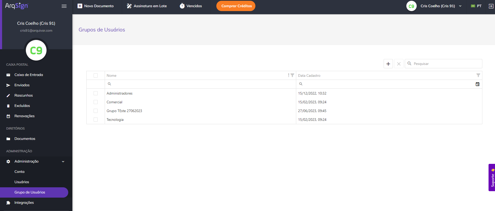
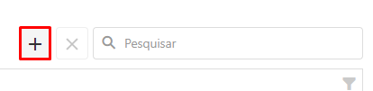
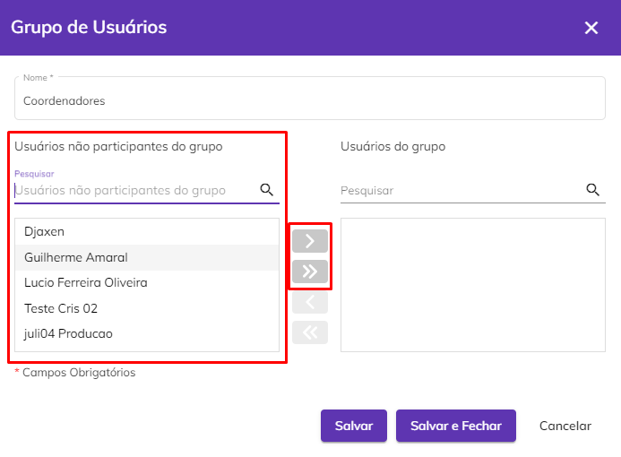
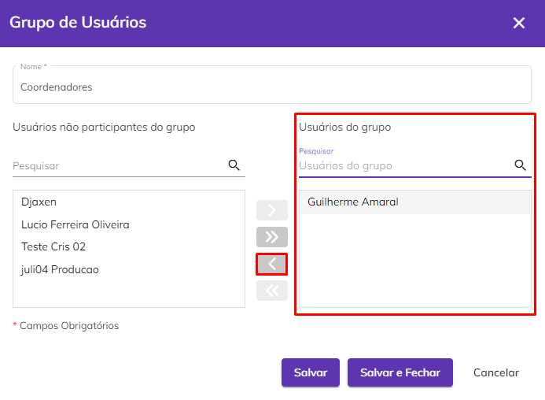
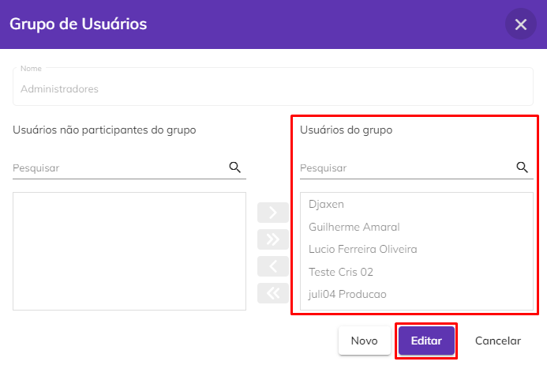
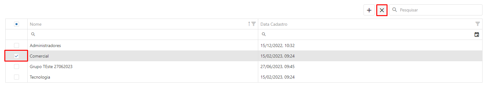
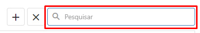

# 🟪 Grupo de Usuários

O objetivo da funcionalidade Grupo de Usuários é agrupar os usuários membros da conta para definir as permissões no menu [Diretórios > Documentos](../../diretorios/documentos.md) aos quais cada grupo terá acesso. As permissões de acesso aos diretórios são atribuídas aos grupos e cada usuário membro da conta é incluído ao grupo pelo proprietário da conta ou pelos administradores globais.

&#x20;Na tela principal de Grupo de Usuários é apresentado o nome do grupo e a data e hora de criação do grupo.

<figure><figcaption></figcaption></figure>

Para criar um grupo, clique no ícone “Novo”.

<figure><figcaption></figcaption></figure>

Informe o nome do grupo. À esquerda serão exibidos todos os usuários que não fazem parte do grupo. É possível pesquisar um usuário utilizando a barra de pesquisa. Para adicionar um ou mais membros ao grupo, selecione os usuários desejados e clique no ícone “Adicionar” ou “Adicionar Todos”.

<figure><figcaption></figcaption></figure>


<mark style="color:orange;">**Serão listados apenas usuários com status “Ativo” e que não sejam administradores globais (já que com esse perfil o usuário não precisa estar incluído em um grupo para acessar as pastas do diretório).**</mark>


Os membros que fazem parte do grupo ou que foram inseridos serão exibidos no campo à direita. Para remover um membro do grupo, selecione seu nome e clique no ícone “Remover”. Para concluir a criação do grupo, clique em “Salvar”.

<figure><figcaption></figcaption></figure>

Para visualizar detalhes do grupo, clique sobre seu nome. Os membros do grupo serão exibidos no campo à direita “Usuários do grupo”. Para editar os membros ou o nome do grupo clique em “Editar”.

<figure><figcaption></figcaption></figure>

Para excluir um ou mais grupos, selecione o grupo desejado e clique no ícone “Excluir”.

<figure><figcaption></figcaption></figure>

É possível realizar a busca pelo nome do grupo utilizando-se a barra de pesquisa superior da tela.  &#x20;

<figure><figcaption></figcaption></figure>
