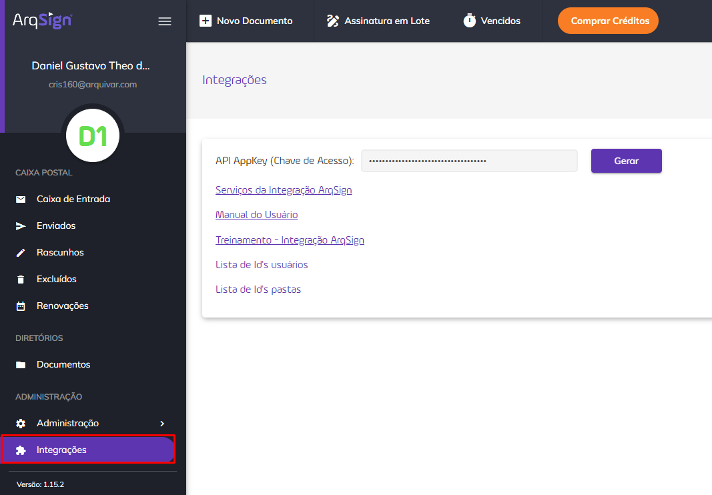

# 🧩 Integrações

A ArqSign conta com sua própria API de Integração. Isso quer dizer que clientes e parceiros podem desenvolver produtos associados a Plataforma ArqSign. A API de Integração permite a comunicação com outros aplicativos/softwares sem o conhecimento ou intervenção do usuário final.

<figure><figcaption>
Clique na imagem para ampliar.
</figcaption></figure>

***

## Métodos disponíveis na API ArqSign

No menu Integrações o usuário encontra os métodos de integração de API da plataforma ArqSign.


<mark style="color:orange;">**Somente contas com assinaturas ativas poderão utilizar a API.**</mark>


Clique aqui para acessar os Serviços de Integração da plataforma ArqSign.
