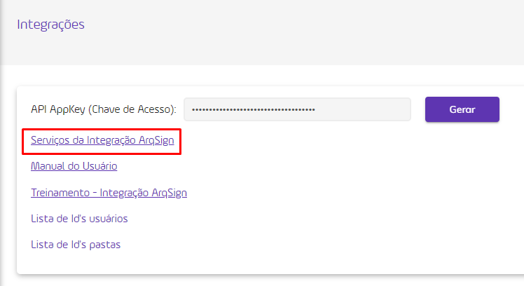
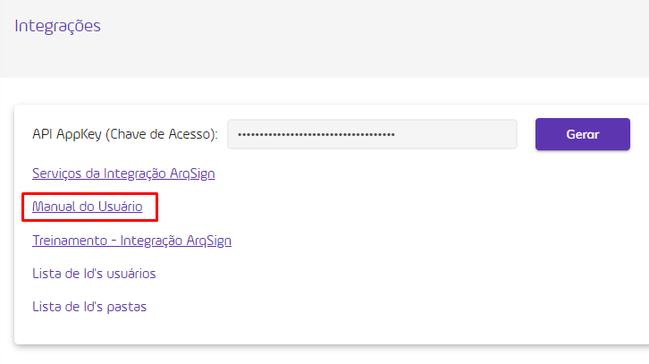
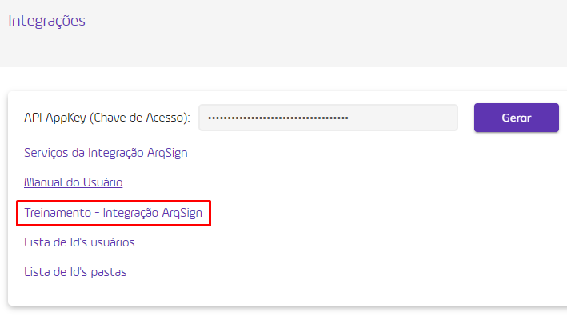
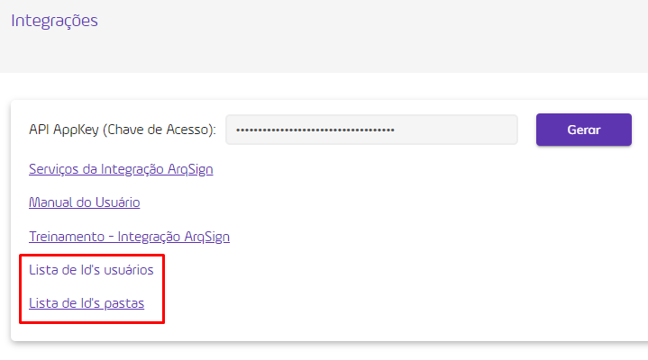
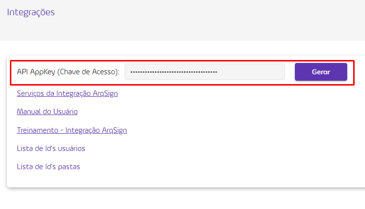

# 🧩 Integrações

A ArqSign conta com sua própria API de Integração. Isso quer dizer que clientes e parceiros podem desenvolver produtos associados a Plataforma ArqSign. A API de Integração permite a comunicação com outros aplicativos/softwares sem o conhecimento ou intervenção do usuário final.

<figure><figcaption>
Clique na imagem para ampliar.
</figcaption></figure>

***

## Métodos disponíveis na API ArqSign

No menu Integrações o usuário encontra os métodos de integração de API da plataforma ArqSign.

> [Clique aqui para acessar os Serviços de Integração da plataforma ArqSign.](https://api.arqsign.com/index.html)


<mark style="color:orange;">**Somente contas com assinaturas ativas poderão utilizar a API.**</mark>


<figure><figcaption></figcaption></figure>

POST/api/v1/processo/enviar-documento-para-assinar

O objetivo deste método é permitir que o usuário envie um documento para ser assinado via plataforma ArqSIGN.

GET/api/v1/processo/{idprocesso}

O objetivo deste método é permitir que o usuário busque os dados completos de um processo, incluindo o documento e o registro de assinatura, caso já exista alguma assinatura no documento.

GET/api/v1/processo/{idProcesso}/status-do-processo

O objetivo deste método é permitir que o usuário busque o status de um processo de assinatura, para que evite buscar o processo como um todo pelo método “GET/api/v1/processo/{idprocesso}” antes que este esteja com status “Concluído”.

GET/api/v1/processo/{idprocesso}/dados-signatarios

O objetivo deste método é permitir que o usuário busque os dados dos signatários que possuem ação de assinar eletronicamente em um processo de assinatura.

PATCH/api/v1/processo/{idProcesso}/reenviar-processo

O objetivo deste método é permitir que o usuário reenvie o processo para os destinatários pendentes de assinaturas na ordem atual. O usuário poderá informar para qual destinatário pendente de assinatura deseja reenviar o documento. Caso não informe os destinatários, o serviço reenvia o processo para todos os destinatários participantes do processo com ação de assinar eletronicamente e que estejam pendentes de assinaturas na ordem atual.

PATCH/api/v1/processo/{idProcesso}/cancelar-processo

O objetivo deste método é permitir que o usuário cancele o processo de assinatura que esteja em andamento.

***

## Funcionamento da API ArqSign

As funções fundamentais de uma API compreendem a obtenção, o envio, a alteração e a exclusão de informações. Isso ocorre quando um aplicativo de cliente ou parceiro envia uma solicitação ao aplicativo ArqSign, que por sua vez gera uma resposta.

Na plataforma ArqSign a integração por meio de API ocorre em três etapas:

1. A aplicação do cliente chama o método POST/api/v1/processo/enviar-documento-para-assinar para enviar um documento a ser assinado. Com a resposta de sucesso, a API retornará o ID do processo gerado e você deve guardá-lo para usar este ID como parâmetro nos outros métodos.
2. &#x20;A aplicação do cliente chama o método GET/api/v1/processo/{idProcesso}/status-do-processo para monitorar o status do processo gerado na Fase 01. Aconselhamos chamar este método no máximo 1x ao dia, não é necessário chamá-lo o tempo todo, uma vez que o status de um processo somente será concluído após a assinatura do documento por todos os signatários.
3. Assim que o processo estiver com o status “Concluído”, você pode passar para a fase 03, quando chamará o método GET/api/v1/processo/{idprocesso} para obter os dados completos do processo e o arquivo assinado.

Ao clicar em “Manual do Usuário” o usuário terá acesso ao manual que apresenta todas as características e métodos de API disponíveis da plataforma ArqSign.

> [Clique aqui para ter acesso ao Manual com o Detalhamento Técnico da API de Integração da ArqSign.](https://arquivar.com.br/wp-content/uploads/2022/09/Manual-API-ArqSign.pdf)

<figure><figcaption></figcaption></figure>

Ao clicar em “Treinamento – Integração ArqSign” o usuário terá acesso a um treinamento elaborado pela Universidade Arquivar que apresenta todas as possibilidades de utilização do API da plataforma ArqSign.

> [Clique aqui para ter acesso ao Treinamento Integração ArqSign.](https://cdn.arquivar.com.br/wp-content/uploads/articulate\_uploads/Curso-API-ArqSign/index.html?&\_ga=2.214775511.1134308362.1699443819-2052664689.1687871591#/)

<figure><figcaption></figcaption></figure>

Para realizar a integração via API são necessários alguns dados de ID’s, que podem ser obtidos clicando em “Lista de Id’s usuários” e “Lista de Id’s pastas”.

<figure><figcaption></figcaption></figure>

***

## API Key – Chave de acesso

Para realizar a integração da plataforma a outras ferramentas via API é necessária uma Chave de Acesso, que o usuário pode obter clicando em “Gerar”. A chave gerada será apresentada no campo “API AppKey” e poderá ser utilizada para realizar a integração.

<figure><figcaption></figcaption></figure>


<mark style="color:red;">**Sempre que clicar no botão “Gerar” será gerada uma nova chave de acesso e todas as integrações feitas utilizando a chave anterior serão desconfiguradas. Sugerimos cuidado ao criar chaves de acesso.**</mark>

