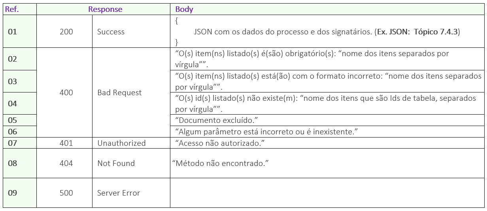

# ✔ GET/api/v1/processo/{idprocesso}/dados-signatarios

## Requisição

<figure><figcaption>
Clique na imagem para ampliar.
</figcaption></figure>

### Detalhamento do Header e Parameters

**Ref. 01:** “AppKey” é a chave de autorização para se autenticar na API. Esta chave deve ser válida e estar vinculada a uma conta ArqSign ativa.

**Ref. 02:** “idProcesso” - Para se obter o status do processo deve ser enviado como parâmetro o ID do processo de assinatura na plataforma ArqSign. Este ID a API devolve como retorno de sucesso, após a chamada do método: [<mark style="background-color:green;">**POST**</mark>**​/api​/v1​/processo​/enviar-documento-para-assinar**](post-api-v1-processo-enviar-documento-para-assinar.md).

Outra forma de obter o ID do processo e por meio da plataforma ArqSign, na opção “Histórico” do documento disponível nas caixas de [Entrada](../../../caixa-postal/caixa-de-entrada.md), [Enviados](../../../caixa-postal/enviados.md) e [Excluídos](../../../caixa-postal/excluidos.md).&#x20;

***

## Retorno

<figure><figcaption>
Clique na imagem para ampliar.
</figcaption></figure>

### Detalhamento do Retorno

**Ref. 01 - Código 200:** Como retorno de sucesso, a aplicação retornará o código 200 juntamente com os dados dos signatários do processo no formato JSON.&#x20;

**Ref. 02 - Código 400:** _Mensagem de item obrigatório:_ Esta mensagem será exibida no singular ou plural quando um ou mais itens obrigatórios não tiver sido enviado na chamada da API.

**Ref. 03 - Código 400:** _Mensagem de formato incorreto:_ Esta mensagem será exibida no singular ou plural quando um ou mais itens estiverem sido enviados com formato incorreto.

**Ref. 04 - Código 400:** _Mensagem de Ids inexistentes:_ Esta mensagem será exibida no singular ou plural quando um ou mais Id enviado não existir.

**Ref. 05 - Código 400:** _Mensagem de documento excluído:_ Esta mensagem será exibida quando o processo em questão tiver sido excluído logicamente.

**Ref. 06 - Código 400:** _Mensagem de parâmetro está incorreto ou é inexistente:_ Quando a chamada é feita com algum parâmetro escrito errado ou parâmetro que não existe no método.

**Ref. 07 - Código 401:** _Mensagem de usuário da API não autorizado:_ AppKey inválida ou não localizada.
