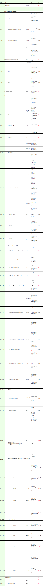

# ✔ POST/api/v1/processo/enviar-documento-para-assinar

### Requisição

<figure><figcaption></figcaption></figure>

### Detalhamento do Header e Body

**Geral:** Os parâmetros não obrigatórios listados abaixo devem constar no JSON, e caso não seja necessário para o documento, enviar com o valor null na frente:

&#x20;    \-> Ref. 03 “ConfiguracoesAvancadas”

&#x20;    \-> Ref. 05 “RenovacoesMeses”

&#x20;    \-> Ref. 08 “MensagemPadrão”

&#x20;    \-> Ref. 10.08 “Seguranca”

&#x20;    \-> Ref. 10.09 “mensagemPersonalizada”

&#x20;    \-> Ref. 10.10 “destinatariosEntradaDto”

&#x20;    \-> Ref. 10.11 “Anexos”

&#x20;    \-> Ref. 10.12 “definirPosicaoAssinaturaAutomatica”

&#x20;    \-> Ref. 10.13 “definirPosicaoAssinaturaManual”

**Ref. 01:** “AppKey” é a chave de autorização para se autenticar na API. Esta chave deve ser válida e estar vinculada a uma conta ArqSIGN ativa.

**Ref. 03:** “ConfiguracoesAvancadas” - As configurações avançadas é um valor opcional para enviar um documento a ser assinado. Quando esta configuração não é enviada, a aplicação utiliza os valores default configurados na conta.

**Ref. 03.01:** “tempoExpiracaoDocumentoDias” - é o tempo de expiração em dias para que o documento seja assinado pelos signatários. Após este tempo, caso o documento não seja assinado, ele expira e fica indisponível para assinatura.

**Ref. 03.02:** “avisoAntesExpiracaoDocumentoDias” - é o tempo em dias que a aplicação usará como referência para começar a notificar o usuário antes da expiração do documento.

**Ref. 03.03:** “frequenciaLembreteDias” - é a frequência para envio de lembrete aos signatários para lembrá-los de assinar o documento.

**Ref. 04:** “idPasta” - é o ID de pasta onde o documento será armazenado dentro da aplicação ArqSIGN.

**Ref. 05:** “renovacaoMeses” - é o tempo em meses contados a partir da data de assinatura do documento, que o mesmo deve ser renovado, gerando lembretes de renovação para o responsável pelo documento.

**Ref. 06:** “assinarOrdemDestinatarios” – quando “true”, significa que os signatários deverão assinar o documento obedecendo uma ordem definida no campo “ordem”. Quando “false” significa que os signatários não deverão assinar obedecendo uma ordem.

**Ref. 07:** “nome” - é o nome do processo de assinatura. Este nome é a referência de busca do documento dentro da aplicação.

**Ref. 08:** “mensagemPadrao” - é a mensagem a ser enviada na notificação para todos os signatários que receberão o documento para ser assinado via Email e que não possuem configuração de “mensagemPersonalizada”.

**Ref. 08. 01:** “titulo” - neste campo deve ser informado o texto que será enviado como assunto da mensagem.

**Ref. 08.02:** “texto” - neste campo deve ser informado o texto que será enviado como corpo da mensagem.

**Ref. 09:** “idResponsavel” - é o ID de um usuário ativo vinculado a conta na Plataforma ArqSIGN que será considerado como responsável pelo documento que está sendo enviado via API. Este usuário receberá notificações de conclusão, recusa de assinatura e lembrete de renovação do documento, caso exista.

**Ref. 10:** “Destinatarios” - nesta parte do JSON devem ser definidos todos os destinatários para o documento em questão. Os destinatários podem ser pessoas que irão assinar o documento ou que receberão uma cópia ao final do processo após a assinatura de todos os signatários.

**Ref. 10.01:** “ordem” – neste campo deve ser enviada a ordem que o signatário irá assinar o documento. Este campo deve possuir valor, caso o campo Ref. 06 “assinarOrdemDestinatario” tenha sido enviado como true. Os destinatários configurados para receberem uma cópia (destinatários do processo que não assinarão o documento) terão a ordem desconsiderada.

**Ref. 10.02:** “nome” – neste campo deve ser enviado o nome do destinatário.

**Ref. 10.03:** “idTipoAção” – neste campo deve ser definido o que o destinatário deverá executar no documento.

&#x20;    \-> 1 = Assinar Online.

&#x20;    \-> 2 = Receber uma cópia.

**Ref. 10.04:** “idTipoAssinatura” – neste campo deve ser definido o tipo de assinatura do destinatário. Quando o “idTipoAção” = 1 (Assinar online), enviar o código de 1 a 4. Quando o “idTipoAção” = 2 (Receber uma cópia), enviar o código 5.

&#x20;     \-> 1 = Assinatura Eletrônica.

&#x20;     \-> 2 = Certificado Digital – ICP Brasil.

&#x20;     \-> 4 = Certificado Digital – Outros.

&#x20;     \-> 5 = Sem Assinatura

**Ref. 10.05:** “idFormaEnvio” – neste campo deve ser enviado como o destinatário deverá receber o documento.

&#x20;    \-> 1 = Email

&#x20;    \-> 2 = WhatsApp

**Ref. 10.06:** “email” - caso o “idFormaEnvio” seja 1 (email), neste campo deve ser enviado o email que o destinatário receberá o documento.

**Ref. 10.07:** “telefone” - caso o “idFormaEnvio” seja 2 (whatsapp), neste campo deve ser enviado o telefone que o destinatário receberá o documento.

**Ref. 10.08:** “seguranca” - nesta parte do JSON pode ser enviado um código de segurança para o usuário informar no momento de assinar o documento. Veja abaixo quais informações precisam ser enviadas para que isso ocorra:

**Ref. 10.08.01:** “idMeioEnvio” - neste campo deve ser informado como o código de segurança deve ser enviado para o destinatário. As opções são:

&#x20;    \-> 1 = SMS (Somente para telefones do Brasil)

&#x20;    \-> 2 = WhatsApp

&#x20;    \-> 3 = Email

&#x20;    \-> 4 = Não enviar (Esta opção deve ser escolhida, quando quem está enviando o documento ao destinatário passará a informação do código de segurança de outra forma, sem usar os meios de notificações da plataforma ArqSign).

**Ref. 10.08.02:** “codigoSeguranca” - neste campo deve ser informado o código de segurança para o destinatário em questão.

**Ref. 10.08.03:** “codigoSegurancaEmail” - caso tenha enviado no campo “idMeioEnvio” a opção 3 = Email, deve-se informar o email para onde a plataforma ArqSIGN enviará o código de segurança.

**Ref. 10.08.04:** “codigoSegurancaTelefone” - caso tenha enviado no campo “idMeioEnvio” a opção 1 = SMS ou 2 = WhatsApp, deve-se informar o telefone para onde a plataforma ArqSIGN enviará o código de segurança.

**Ref. 10.08.05:** “reenviarCodigo” - caso tenha enviado no campo “idMeioEnvio” a opção 1 = SMS ou 2 = WhatsApp, deve-se informar neste campo se o destinatário ao receber o documento para assinar poderá solicitar o reenvio do código. Este reenvio será computado nos créditos de SMS e WhatsApp da conta. Para permitir o reenvio do código, envie a informação 1 = True, para não permitir o reenvio, envie a informação 0 = False.

**Ref. 10.09:** “mensagemPersonalizada” - nesta parte do JSON pode se enviar uma mensagem personalizada para o signatário em questão, caso ele receba o documento para assinar por e-mail.

**Ref. 10.09.01:** “titulo” - neste campo deve ser informado o texto que será enviado como assunto da mensagem.

**Ref. 10.09.02:** “texto” - neste campo deve ser informado o texto que será enviado como corpo da mensagem.

**Ref. 10.10:** “destinatariosEntradaDto” - nesta parte do JSON devem ser enviadas as configurações de dados que serão solicitados ao signatário no momento da assinatura.

**Ref. 10.10.01:** “infComplNomeSignatarioObrigatorio” - envie 1 = true para obrigar o signatário a informar o nome completo, envie 0 = false para não obrigar o signatário a informar o nome completo.

**Ref. 10.10.02:** “infComplDocumentoSignatarioObrigatorio” - envie 1 = true para obrigar o signatário a informar um documento de identificação de PF, envie 0 = false para não obrigar o signatário a informar um documento de identificação de PF.

**Ref. 10.10.03:** “infComplRazaoSocialObrigatorio” - envie 1 = true para obrigar o signatário a informar o nome da empresa, envie 0 = false para não obrigar o signatário a informar o nome da empresa.

**Ref. 10.10.04:** “infComplIdentificadorObrigatorio” - envie 1 = true para obrigar o signatário a informar um documento de identificação de PJ, envie 0 = false para não obrigar o signatário a informar um documento de identificação de PJ.

**Ref. 10.10.05:** “idInfComplTipoDocumentoSignatarioPF” - neste campo deve ser informado o tipo de documento a ser informado como PF, as opções são:

&#x20;    \-> 1 = CPF

&#x20;    \-> 2 = CNH

&#x20;    \-> 3 = RG

&#x20;    \-> 4 = Outro

**Ref.10.10.06:** “infComplDocumentoNomePF” - quando no JSON, o campo “idInfComplTipoDocumentoSignatarioPF” estiver com o valor 4 = Outro, é necessário enviar neste campo um nome que irá identificar esta opção “Outro” para o signatário no momento da assinatura.

**Ref.10.10.07:** “idInfComplTipoDadosIndentificadorPF” - quando no JSON, o campo “idInfComplTipoDocumentoSignatarioPF” estiver com o valor 4 = Outro, é necessário enviar neste campo a informação se o documento de PF deve ser do tipo 1 = Texto ou 2 = Numérico.

**Ref.10.10.08:** “infComplQtdeCaracteresPF” - quando no JSON, o campo “idInfComplTipoDocumentoSignatarioPF” estiver com o valor 4 = Outro, é necessário enviar neste campo a quantidade de caracteres para a aplicação validar o documento de PF.

**Ref. 10.10.09:** “idInfComplTipoDocumentoSignatarioPJ” - neste campo deve ser informado o tipo de documento a ser informado como PJ, as opções são:

&#x20;    \-> 4 = Outro

&#x20;    \-> 5 = CNPJ

**Ref.10.10.10:** “infComplDocumentoNomePJ” - quando no JSON, o campo “idInfComplTipoDocumentoSignatarioPJ” estiver com o valor 4 = Outro, é necessário enviar neste campo um nome que irá identificar esta opção “Outro” para o signatário no momento da assinatura.

**Ref.10.10.11:** “idInfComplTipoDadosIndentificadorPJ” - quando no JSON, o campo “idInfComplTipoDocumentoSignatarioPJ” estiver com o valor 4 = Outro, é necessário enviar neste campo a informação se o documento de PJ deve ser do tipo 1 = Texto ou 2 = Numérico.

**Ref.10.10.12:** “infComplQtdeCaracteresPJ” - quando no JSON, o campo “idInfComplTipoDocumentoSignatarioPJ” estiver com o valor 4 = Outro, é necessário enviar neste campo a quantidade de caracteres para a aplicação validar o documento de PJ.

**Ref. 10.11:** “Anexos” - nesta parte do JSON devem ser enviadas as configurações de arquivos a serem solicitados aos signatários no momento da assinatura.

**Ref. 10.11.01:** “anexoDocumentoNome” – envie neste campo o nome do arquivo que deseja que o signatário faça o upload. Exemplo: Frente da Identidade, Selfie etc.

**Ref. 10.11.02:** “anexoObrigatorio” - envie 1 = true para obrigar o signatário a fazer o upload deste anexo, ou 0 = false para não obrigar.

**Ref. 10.11.03:** “anexoExibirTodosDestinatarios” - envie 1 = true para após a conclusão do processo de assinatura, este anexo estar disponível para todos os signatários ou envie 0 = false para este anexo estar disponível somente para você que enviou o documento para ser assinado e para quem fez o upload do anexo.

**Ref. 10.12:** “definirPosicaoAssinaturaAutomatica” - neste campo deve ser enviada a informação se a plataforma deverá ou não definir de forma automática o posicionamento da assinatura para o signatário.


<mark style="color:orange;">**No JSON, todos os destinatários com a ação de “Assinar Online” precisam ter o posicionamento da representação visual de forma automática ou manual. Para inserir o posicionamento automático da assinatura, a aplicação irá inserir uma página em branco ao final do arquivo com os locais onde todos os signatários assinarão. Desta forma, ao enviar um documento a ser assinado via API, deve-se deixar a aplicação definir o posicionamento da assinatura para todos os signatários ou para nenhum. Não é possível uma opção híbrida, um signatário se envia o posicionamento da assinatura e outro a aplicação escolhe automaticamente.**</mark>

<mark style="color:orange;">**Então neste campo teremos as seguintes opções:**</mark>

* <mark style="color:orange;">**Null: ao enviar este parâmetro como null, significa que a aplicação não irá definir o posicionamento da assinatura para os signatários de forma automática, ou seja, será necessário enviar os dados de posicionamento no JSON (definirPosicaoAssinaturaManual).**</mark>
* <mark style="color:orange;">**1 = PF: ao enviar este parâmetro com valor 1, significa que a aplicação ArqSign irá incluir uma página no final do arquivo com a definição automática da posição da assinatura do tipo Pessoa Física (PF).**</mark>
* <mark style="color:orange;">**2 = PJ: ao enviar este parâmetro com valor 2, significa que a aplicação ArqSign irá incluir uma página no final do arquivo com a definição automática da posição da assinatura do tipo Pessoa Jurídica (PJ).**</mark>
* <mark style="color:orange;">**3 = PF e PJ: ao enviar este parâmetro com valor 3, significa que a aplicação ArqSign irá incluir uma página no final do arquivo com a definição automática da posição para duas assinaturas, uma do tipo Pessoa Física (PF) e uma do tipo Pessoa Jurídica (PJ).**</mark>


**Ref. 10.13:** “definirPosicaoAssinaturaManual” - nesta parte do JSON devem ser enviados os dados de posicionamento da assinatura no documento. Esta parte deve ser enviada obrigatoriamente se no campo “definirPosicaoAssinaturaAutomatica”, tiver sido enviada a informação “Null”.

**Ref. 10.13.01:** “pessoaFisica” - se este signatário for assinar como pessoa física, envie nesta parte o posicionamento da assinatura em questão.

**Ref. 10.13.01.01:** “pagina” - envie o número da página onde a assinatura deve ser posicionada.

**Ref. 10.13.01.02:** “Altura” - envie a altura em milímetros do tamanho da caixa onde a assinatura será aplicada.

**Ref. 10.13.01.03:** “Largura” - envie a largura em milímetros do tamanho da caixa onde a assinatura será aplicada.

**Ref. 10.13.01.04:** “PosicaoX” - envie a posição em milímetros da borda esquerda da página até a borda esquerda da caixa da assinatura.

**Ref. 10.13.01.05:** “PosicaoY” - envie a posição em milímetros da borda superior da página até a borda superior da caixa da assinatura.

**Ref. 10.13.02:** “pessoaJuridica” - se este signatário for assinar como pessoa jurídica, envie nesta parte o posicionamento da assinatura em questão.

**Ref. 10.13.02.01:** “pagina” - envie o número da página onde a assinatura deve ser posicionada.

**Ref. 10.13.02.02:** “Altura” - envie a altura em milímetros do tamanho da caixa onde a assinatura será aplicada.

**Ref. 10.13.02.03:** “Largura” - envie a largura em milímetros do tamanho da caixa onde a assinatura será aplicada.

**Ref. 10.13.02.04:** “PosicaoX” - envie a posição em milímetros da borda esquerda da página até a borda esquerda da caixa da assinatura.

**Ref. 10.13.02.05:** “PosicaoY” - envie a posição em milímetros da borda superior da página até a borda superior da caixa da assinatura. Na figura abaixo está a representação visual das medidas que precisam ser identificadas no seu modelo de documento (Altura, Largura, PosicaoX e PosicaoY).&#x20;

<figure><figcaption></figcaption></figure>

Para saber como tirar estas medidas, assista ao vídeo abaixo:



**Ref. 11:** “Documento” - nesta parte do JSON deve ser enviado o arquivo a ser assinado. O arquivo deve ser no formato PDF limitado a 100 MB.

**Ref. 11.01:** “arquivo” - envie neste campo o arquivo em Base64.

**Ref. 11.02:** “nomeComExtensao” - envie o nome do arquivo com sua extensão.
