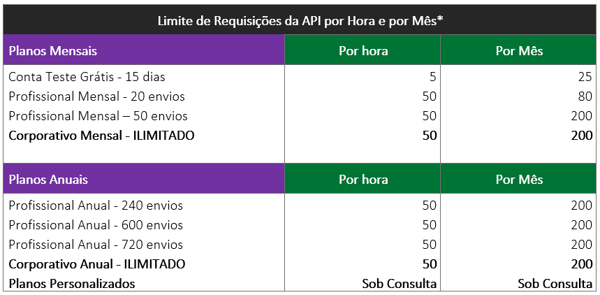

# 🟪 Limites de Requisições da API

<figure><figcaption></figcaption></figure>

Os limites de requisições garantem estabilidade e segurança dos serviços para os clientes. Entretanto, se o seu negócio tem uma demanda maior do que a mencionada acima, com planejamento teremos condições de atender à sua demanda sem prejudicar a estabilidade e a segurança dos serviços.

Para isso, entre em contato conosco por meio do telefone 4003-8839 ou pelo e-mail comercial@arqsign.com, para que possamos elaborar um plano sob medida para você.

