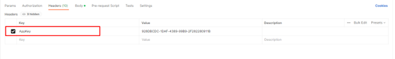

# 🟪 Requisitos para uso da API

1. [Acesse sua conta](../../#pagina-de-login-autenticacao-na-plataforma-arqsign) ou crie uma [conta teste grátis](../../#criacao-de-conta-teste-gratis) na Plataforma ArqSign. Depois de autenticado, clique no [menu Integrações e acesse sua API AppKey](./#api-key-chave-de-acesso), ID de usuário e ID de pasta.

<figure><figcaption></figcaption></figure>

2. Para testes, use a ferramenta Postman e para Authorization use o tipo AppKey.

<figure><figcaption>
Clique na imagem para ampliar.
</figcaption></figure>

#### Requisitos

* Ter uma conta na plataforma ArqSign ativa.
* Ter uma [chave de acesso a API válida](./#api-key-chave-de-acesso). Esta chave chamamos de AppKey.
* Para o método [<mark style="background-color:green;">**POST**</mark>**/api/v1/processo/enviar-documento-para-assinar**](detalhes-dos-metodos/post-api-v1-processo-enviar-documento-para-assinar.md), será necessário ter em mãos:

&#x20;    \-> _ID de um usuário da conta com status ativo:_ para ser responsável pelos documentos que serão enviados pela API. &#x20;

&#x20;    \-> _ID de pasta:_ onde o documento a ser gerado deve ser armazenado na plataforma.


<mark style="color:orange;">**A funcionalidade de**</mark> [<mark style="color:blue;">**Diretórios**</mark>](broken-reference) <mark style="color:orange;">**irá permitir ao cliente ter várias pastas organizadoras dentro da plataforma. Caso o plano do cliente seja grátis, a conta terá acesso somente a uma pasta que chamamos de “Pasta Raiz”. Neste caso, será necessário o ID desta pasta para usar a API. Para obter a AppKey, os ID’s dos usuários e os ID’s das Pastas, o**</mark> [<mark style="color:blue;">**menu Integrações**</mark>](./)<mark style="color:orange;">**.**</mark>

