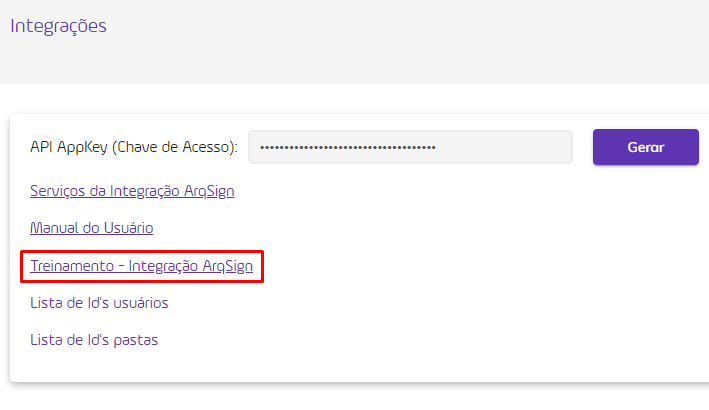

# 🟪 Tela Menu Integrações

A ArqSign conta com sua própria API de Integração. Isso quer dizer que clientes e parceiros podem integrar as funcionalidades da Plataforma ArqSign à suas soluções. A API de Integração permite a comunicação com outros aplicativos/softwares de forma automática, ou seja, sem o conhecimento ou intervenção do usuário final.

<figure><figcaption>
Clique na imagem para ampliar.
</figcaption></figure>

***

## API Key – Chave de acesso

Para realizar a integração da plataforma a outras ferramentas via API é necessária uma Chave de Acesso, que o usuário pode obter clicando em “Gerar”. A chave gerada será apresentada no campo “API AppKey” e poderá ser utilizada para realizar a integração.

<figure><figcaption>
Clique na imagem para ampliar.
</figcaption></figure>


<mark style="color:red;">**Sempre que clicar no botão “Gerar” será gerada uma nova chave de acesso e todas as integrações feitas utilizando a chave anterior serão desconfiguradas. Sugerimos cuidado ao criar chaves de acesso.**</mark>


***

## Serviços de Integração ArqSign

Ao clicar neste link, a aplicação irá abrir a página api.arqsign.com com os métodos disponíveis até o momento.

> [Clique aqui para acessar os Serviços de Integração da plataforma ArqSign.](https://api.arqsign.com/index.html)

<figure><figcaption>
Clique na imagem para ampliar.
</figcaption></figure>

***

## Manual do Usuário

Ao clicar em “Manual do Usuário” o usuário terá acesso a este manual, que apresenta todas as características e métodos de API disponíveis da plataforma ArqSign.

<figure><figcaption>
Clique na imagem para ampliar.
</figcaption></figure>

***

## Treinamento - Integração ArqSign

Ao clicar em “Treinamento – Integração ArqSign” o usuário terá acesso a um treinamento elaborado pela Universidade Arquivar que apresenta todas as possibilidades de utilização do API da plataforma ArqSign.

> [Clique aqui para ter acesso ao Treinamento Integração ArqSign.](https://cdn.arquivar.com.br/wp-content/uploads/articulate\_uploads/Curso-API-ArqSign/index.html?&\_ga=2.214775511.1134308362.1699443819-2052664689.1687871591#/)

<figure><figcaption>
Clique na imagem para ampliar.
</figcaption></figure>

***

## Lista de ID's

Para realizar a integração via API são necessários alguns dados de ID’s, que podem ser obtidos clicando em “Lista de Id’s usuários” e “Lista de Id’s pastas”.

<figure><figcaption>
Clique na imagem para ampliar.
</figcaption></figure>

**Lista de Id’s usuários:** Ao clicar neste link a aplicação irá fazer o download de um arquivo .csv com a lista de todos os usuários ativos na conta e seu respectivo ID.

**Lista de Id’s pastas:** Ao clicar neste link a aplicação irá fazer o download de um arquivo .csv com a lista de todas as pastas não excluídas da conta e seu respectivo ID.
