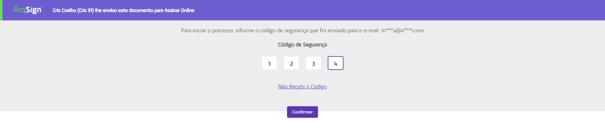
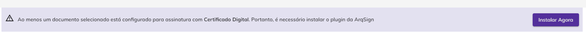
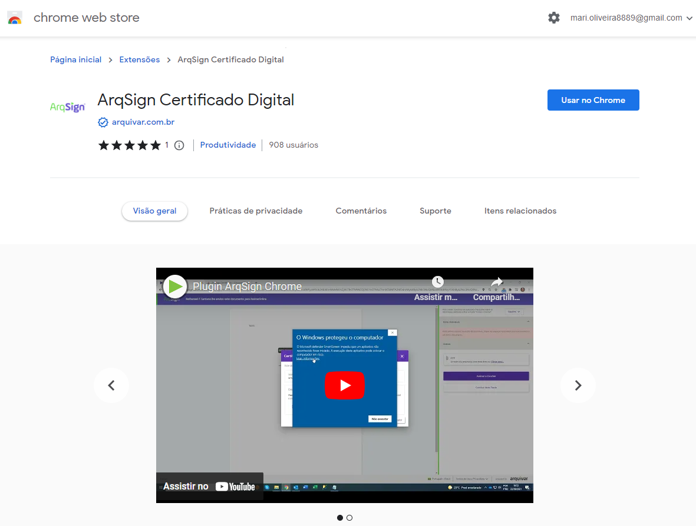
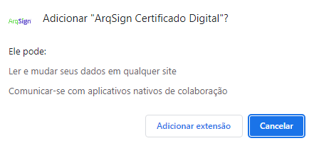
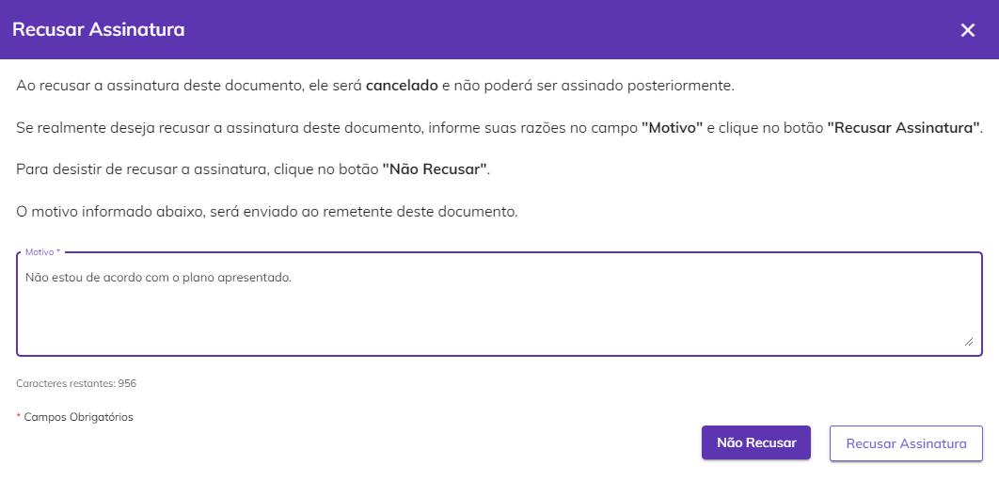

# ✍ Assinatura de Documentos

O processo de assinatura eletrônica de documentos pode ser realizado por dois caminhos:



Ocorre quando o responsável recebe uma notificação por e-mail, informando que o documento deve ser assinado e disponibilizando o link para acesso ao documento. &#x20;

O usuário responsável pela assinatura receberá uma notificação por e-mail com o link para acesso ao arquivo. Este e-mail apresentará também o nome do remetente e o prazo para assinatura. Se o destinatário tiver definido uma mensagem personalizada, ela também será exibida nesta notificação.&#x20;

<figure><figcaption></figcaption></figure>

Ao clicar no link ou informar o código, o usuário será direcionado para a tela de login. Se ele já tiver uma conta ativa na plataforma de assinatura poderá optar por realizar a assinatura do documento sem se conectar na plataforma ou informar suas credenciais para acessar.  &#x20;

Se o usuário não tiver uma conta cadastrada na plataforma, ele será direcionado para a tela de assinatura sem precisar informar credenciais, mas ao final do processo será exibida uma mensagem de sugestão para que ele crie uma conta de teste grátis. &#x20;


<mark style="color:orange;">**A criação da conta de teste grátis não é obrigatória.**</mark>&#x20;


<figure><figcaption></figcaption></figure>



Ocorre quando o responsável pela assinatura acessa diretamente a plataforma e verifica a lista de documentos pendentes de assinatura. &#x20;

Depois de conectado à conta, o usuário deve clicar no menu [Caixa Postal > Caixa de Entrada.](caixa-postal/caixa-de-entrada.md) Para assinar um documento, deve é preciso clicar no botão “Assinar” do arquivo desejado.&#x20;

<figure><figcaption></figcaption></figure>



***

## Assinando um documento

### 1. Acessando o documento&#x20;

Se o remetente tiver definido um código de segurança para abertura do documento, será solicitado que o signatário informe o código, que deve ter sido recebido anteriormente por e-mail, Whatsapp, SMS ou pelo próprio remetente. Caso não possua o código o usuário deve clicar em “Não Recebi o Código”.&#x20;

<figure><figcaption></figcaption></figure>

<figure><figcaption></figcaption></figure>

O documento será apresentado na tela para assinatura. Para assinar, o signatário deve clicar na área reservada para assinatura e escolher o Estilo de Assinatura. &#x20;

<figure><figcaption></figcaption></figure>


<mark style="color:blue;">Para  alterar o idioma da tela de visualização do documento, no canto inferior direito da tela escolha entre "Inglês - USA", "Espanhol - Espanha" ou "Português - Brasil".</mark>



***

### 2. Definindo o Estilo de Assinatura&#x20;

O Estilo de Assinatura é a representação visual da assinatura do usuário. Para concluir a assinatura de um documento, o usuário deverá escolher de que forma irá assinar:&#x20;

* **Padrão:** Neste estilo o usuário deve informar o nome completo e definir o estilo (fonte) como o texto deverá ser apresentado. Para isso deve clicar em “Estilo” e fazer a definição.&#x20;

<figure><figcaption></figcaption></figure>

* **Desenho:** Para assinar com um desenho, o usuário deverá, no campo “Área de Desenho da Assinatura” assinar ou rubricar utilizando o mouse. Para corrigir, deve clicar no ícone “Apagar”.&#x20;

<figure><figcaption></figcaption></figure>

* **Imagem:** Se desejar, o usuário pode fazer o upload de uma imagem que represente sua assinatura.

<figure><figcaption></figcaption></figure>

Para concluir o signatário deve clicar em “Aplicar”. Se foi solicitado no documento que ele assine como Pessoa Física e Jurídica, pode utilizar a mesma assinatura para as duas situações clicando em “Aplicar PF e PJ”.&#x20;

<figure><figcaption></figcaption></figure>

***

### 3. Assinando eletronicamente/digitalmente


<mark style="color:blue;">**ASSINATURA ELETRÔNICA X ASSINATURA DIGITAL (ICP Brasil e ICP Outros)**</mark>

<mark style="color:blue;">**Assinatura eletrônica**</mark> <mark style="color:blue;"></mark><mark style="color:blue;">é aquela que não precisa de um certificado digital. É mais utilizada para assinar contratos e documentos entre entes privados (B2B, B2C).</mark>&#x20;

<mark style="color:blue;">**Assinatura digital**</mark> <mark style="color:blue;"></mark><mark style="color:blue;">é aquela que precisa de um certificado digital. É mais utilizada para emissão de notas fiscais e para transações com o governo.</mark>&#x20;

<mark style="color:blue;">Na Plataforma Arqsign, ao configurar um fluxo de assinaturas você pode determinar qual tipo de assinatura deverá ser executada por destinatário escolhendo entre:</mark>&#x20;

<mark style="color:blue;">**a) Assinatura eletrônica**</mark> <mark style="color:blue;"></mark><mark style="color:blue;">(a ArqSign produz assinaturas eletrônicas avançadas com validade jurídica de acordo com MP 2.200-2 de 24/08/2001 e Lei 14.063 de 23/11/2020). Sempre que um signatário assina um documento de forma eletrônica a Arqsign aplica um certificado digital próprio da plataforma, capturando o Hash (identificação única) do arquivo, verificando a integridade do arquivo e anexando ao certificado a identificação do signatário.</mark>  &#x20;

<mark style="color:blue;">**b) Assinatura digital – ICP-Brasil ou ICP Outros**</mark> <mark style="color:blue;"></mark><mark style="color:blue;">(A ArqSign produz assinaturas digitais qualificadas de acordo com MP 2.200-2 de 24/08/2001 e Lei 14.063 de 23/11/2020). Quando o usuário já possui um certificado digital e deseja utilizá-lo para realizar a assinatura por meio da ArqSign, este certificado é utilizado para verificar a integridade da assinatura e identificar o usuário como signatário no documento.</mark>&#x20;


Depois de definir o Estilo de Assinatura, será solicitada a assinatura do usuário que pode ser:

#### A. Assinatura Eletrônica

Na assinatura eletrônica o usuário informa seus dados de pessoa física ou jurídica e a própria Arquivar certifica a autenticidade e veracidade das informações apresentadas.&#x20;

Se o usuário estiver utilizando uma assinatura eletrônica, será necessário que informe os campos obrigatórios solicitados na área “**Dados**”. Os campos obrigatórios variam de acordo com o documento. O símbolo **\*** indica que a informação é de preenchimento obrigatório.&#x20;

<figure><figcaption></figcaption></figure>

#### B. Assinatura Digital – ICP Brasil e Outros

Se tiver sido definido que o usuário deverá assinar utilizando um certificado digital (ICP Brasil e ICP outros), ele não precisará informar nenhum dado, devendo apenas selecionar o [Estilo de Assinatura ](assinatura-de-documentos.md#2.-definindo-o-estilo-de-assinatura)que irá utilizar, aceitar o **Termo de Assinatura Eletrônica** e clicar em “Assinar e Concluir”.&#x20;

Será exibida uma lista com todos os certificados instalados na máquina do usuário e na conta da plataforma ArqSign. Ele deverá selecionar aquele com o qual irá assinar, informar o código PIN do certificado (se solicitado) e clicar em “Avançar”, caso ele precise assinar também como Pessoa Jurídica, ou em “Concluir” para finalizar.  &#x20;


<mark style="color:orange;">**Os certificados hospedados na conta da plataforma ArqSign do usuário apresentados aqui deverão ter sido anteriormente importados na tela**</mark> [<mark style="color:blue;">**Meu Perfil > Aba Certificado Digital.**</mark> ](menu-superior/meu-perfil.md)


<figure><figcaption></figcaption></figure>

<figure><figcaption></figcaption></figure>

Instalação dos plugins necessários para a utilização dos certificados digitais

Caso ainda não tenha feito, ao assinar um documento pela primeira vez utilizando um certificado digital será solicitado ao usuário que instale os plugins “ArqSign Certificado Digital” (disponível [clicando aqui](https://chrome.google.com/webstore/detail/arqsign-certificado-digit/fjdnpmenmpfadeojgkhgiogiclmcjgbp?hl=pt-br)) e AppNative – Módulo Desktop (disponibilizado durante o processo).

1\. Ao clicar em “Instalar Agora”, será aberta a janela com o link para o download do plugin “ArqSign Certificado Digital”.&#x20;

2\. Faça a instalação da extensão de acordo com o navegador que estiver utilizando.&#x20;

3\. Depois da concluir a primeira instalação, retorne à plataforma ArqSign e prossiga com a instalação do aplicativo AppNative clicando em “Clique aqui para fazer o download...”.&#x20;

4\.  Depois de concluir a segunda instalação, retorne à plataforma ArqSign. Será exibida uma mensagem de conclusão das instalações.&#x20;

***

### 4. Informações complementares

Se houver sido solicitado ao signatário anexar arquivos, no campo “Anexos” no lado direito da tela ele deverá fazer o upload dos documentos solicitados.&#x20;

<figure><figcaption></figcaption></figure>

Será solicitado que o usuário assine o termo de responsabilidade marcando a checkbox “**Confirmo que li e concordo com os termos de assinatura eletrônica**”. &#x20;

<figure><figcaption></figcaption></figure>

Ao concluir as obrigatoriedades de assinatura, o usuário pode escolher entre “Assinar e Concluir” para finalizar sua assinatura ou em “Concluir Mais Tarde”, para retornar ao documento e concluir em outro momento.&#x20;

<figure><figcaption></figcaption></figure>

***

### 5. Concluindo a assinatura

Caso opte por concluir, será exibida uma mensagem de confirmação da assinatura. Caso o usuário não possua conta, será convidado a criar uma conta de teste grátis ou poderá clicar em “Mais tarde”, para retornar em outro momento. Caso já possua conta, deverá clicar em “Fechar” para encerrar o processo.&#x20;

<figure><figcaption></figcaption></figure>

Depois de concluído o processo e todos os signatários assinarem o documento, todos os participantes receberão por e-mail ou Whatsapp uma cópia do documento assinado e o Registro de Assinaturas, com o código ID do documento, informações dos certificados digitais e assinaturas eletrônicas utilizados para assinar o documento e histórico de eventos relacionados ao documento.&#x20;

<figure><figcaption></figcaption></figure>

Se o remetente tiver definido que deverá ser gerado um QR Code no Registro de Assinaturas na tela [Configurações Avançadas do cadastro do documento](menu-superior/novo-documento.md#configuracoes-avancadas), esse QR Code será exibido aqui.&#x20;

<figure><figcaption></figcaption></figure>

***

## Ações da tela de Assinatura

Clicando no botão “Opções” no cato superior direito da tela de assinatura o usuário terá acesso às seguintes opções:&#x20;

<figure><figcaption></figcaption></figure>

**Baixar Arquivo:** Utilizado para fazer o download do documento.&#x20;

**Recusar Assinatura:** Utilizado quando por algum motivo o signatário não deseja assinar o documento. Neste caso ele deve inserir uma justificativa para a recusa e clicar em “Recusar Assinatura”. Ao recusar a assinatura o processo de assinatura do documento será automaticamente cancelado para todos os envolvidos e aparecerá com o status “Cancelado” para o remetente responsável pelo documento. &#x20;

<figure><figcaption></figcaption></figure>

**Exibir Histórico:** Utilizado para visualizar informações sobre o documento e o histórico dos eventos relacionados a ele. Também é possível fazer o download dos arquivos originais do processo, antes das assinaturas concluídas.&#x20;

<figure><figcaption></figcaption></figure>

**Registro de Assinaturas:** Utilizado para fazer o download do registro das assinaturas realizadas no documento. O Registro de Assinaturas exibe todas as informações sobre as assinaturas eletrônicas realizadas, como nome dos assinantes, data e hora da assinatura, localização e IP de onde foi realizada, dados dos certificados digitais utilizados etc. &#x20;

<figure><figcaption></figcaption></figure>

**Termo de Assinatura Eletrônica:** Clicando nesta opção será exibido o Termo de Assinatura Eletrônica apresentado a todos os signatários de reconhecimento da veracidade e autenticidade dos documentos assinados. É possível também imprimir esse termo clicando no ícone de impressão.&#x20;

<figure><figcaption></figcaption></figure>
