# ✉ Caixa de Entrada

Na Caixa de Entrada são listados todos os documentos nos quais o usuário participa do processo de assinatura como signatário, ou seja, como assinante por meio da Plataforma ArqSign.

O signatário de um processo de assinatura pode ser também o remetente do documento e neste caso o documento será exibido tanto na Caixa de Entrada quanto no [menu Enviados](enviados.md).


<mark style="color:orange;">**Não serão exibidos na Caixa de Entrada documentos que já tenham expirado, ou seja, cujo prazo para assinatura já tenha terminado.**</mark>


<figure>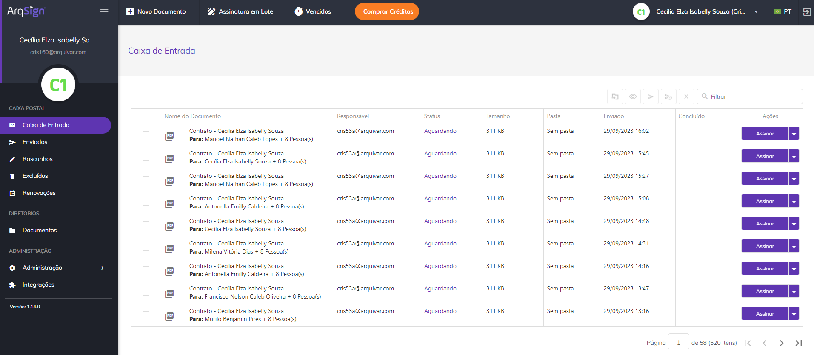<figcaption>
Clique na imagem para ampliar.
</figcaption></figure>

Ao clicar em um documento, será aberta a tela de visualização do documento, que apresenta o documento enviado, seus status e data de vencimento. No canto direito da tela são apresentadas informações dos signatários como dados pessoais, papel de signatário e status da assinatura.

<figure>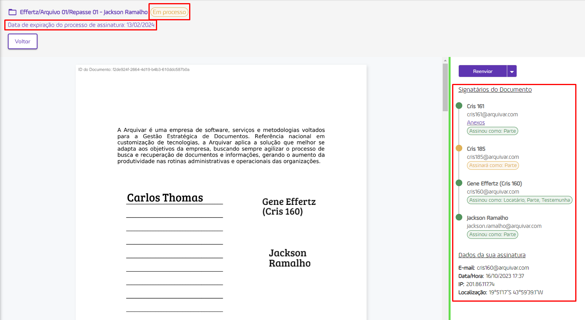<figcaption>
Clique na imagem para ampliar.
</figcaption></figure>

***

## Colunas da tela principal - Caixa de Entrada

<figure>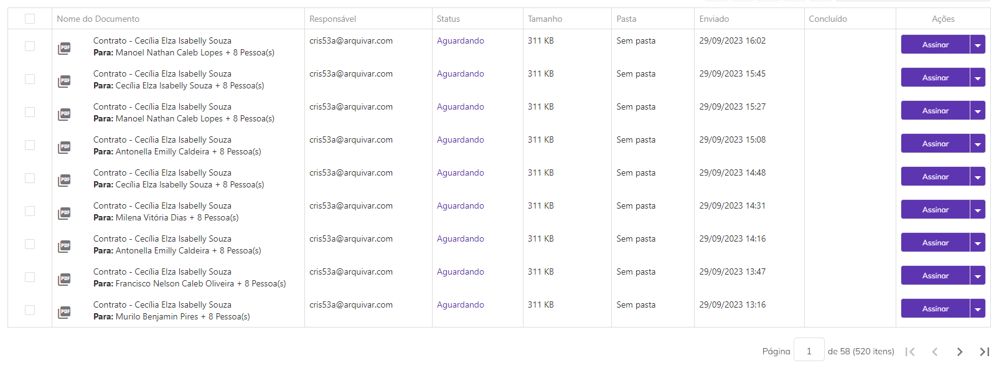<figcaption>
Clique na imagem para ampliar.
</figcaption></figure>

**Coluna Nome do Documento:** Nesta coluna são exibidos o nome do documento e o nome do signatário. Se houver mais de um signatário será mostrado o nome do primeiro e a quantidade de outras pessoas que deverão assinar.&#x20;

**Coluna Responsável:** Nesta coluna são apresentados o nome e e-mail de quem enviou o documento (remetente).

**Coluna Status:** Os status possíveis para um documento são: “Aguardando” (nenhum participante assinou o documento até o momento), “Em processo” (um ou mais participantes já assinaram o documento, mas ainda faltam assinaturas) e “Concluído” (todos os participantes já assinaram o documento). Ao passar o mouse sobre o status são exibidas informações sobre quais signatários ainda estão com assinatura pendente e quais já concluíram, além dos dados desses signatários.

<figure>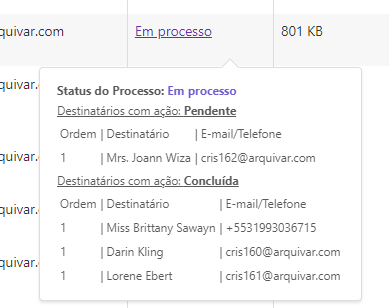<figcaption>
Clique na imagem para ampliar.
</figcaption></figure>

**Coluna Tamanho:** Nesta coluna é exibido o tamanho do arquivo do documento.&#x20;

**Coluna Pasta:** Nesta coluna é exibida a pasta do diretório onde o documento está armazenado. Caso o usuário não tenha permissão de acesso à pasta, será exibido “Sem pasta”.

**Coluna Enviado:** Informações sobre a data e hora em que o documento foi enviado.

**Coluna Concluído:** Informações sobre a data e hora em que o processo de assinatura do documento foi concluído. Caso ainda não tenha sido concluído esta coluna ficará em branco.

**Coluna Ações:** Esta coluna exibe botões de ação sobre o documento. Esses botões serão exibidos de acordo com o perfil do usuário. Será sempre exibida nesse botão a ação prioritária de execução, de acordo com o perfil do usuário e status do documento.

**Barra de filtro:** É possível localizar um ou mais documentos utilizando-se os filtros disponíveis para busca. A busca pode ser feita pelo nome ou e-mail do responsável pelo envio, pelo nome de um dos signatários, pelo status do documento (na Caixa de Entrada só serão exibidos os documentos com status “Concluído”, Aguardando” e “Em processo”), pela pasta onde o documento está armazenado ou pela data de conclusão das assinaturas.

<figure>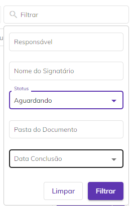<figcaption></figcaption></figure>

***

## Ações individuais - Caixa de Entrada

<figure>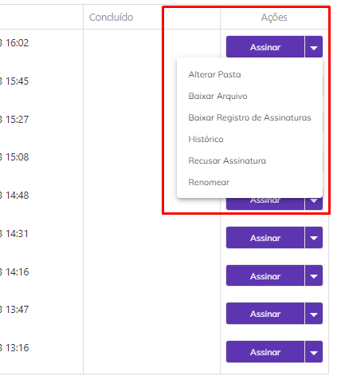<figcaption></figcaption></figure>

**Assinar:** Disponível somente se o documento ainda não tiver sido assinado pelo signatário e seja a sua vez de assinar de acordo com a ordem estabelecida pelo remetente, se houver. Ao clicar neste botão o usuário é direcionado para a [tela de assinatura do documento.](broken-reference)

**Alterar Pasta:** Esta opção só será exibida se o usuário tiver acesso à conta na qual o documento está armazenado. Ao clicar nesta opção ele poderá alterar a pasta do diretório onde o documento está armazenado.

<figure>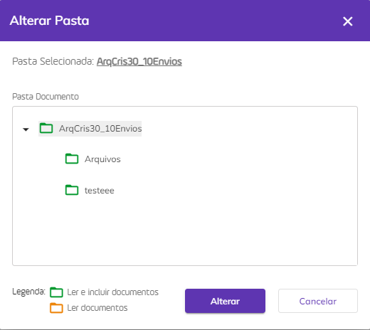<figcaption></figcaption></figure>

**Alterar Proprietário:** Esta opção só será exibida se o usuário além de signatário for também o remetente do documento. Ao clicar nesta opção ele poderá alterar o proprietário do documento. Ao executar essa ação não será possível realizar outras atividades de gestão do documento.


&#x20;<mark style="color:orange;">**Só podem ser selecionados como novo proprietários usuários cadastrados na mesma conta do responsável.**</mark>&#x20;

<mark style="color:orange;">**O Administrador Global que não for o remetente do documento, poderá alterar a propriedade de documentos concluídos que estão listados na funcionalidade**</mark> [<mark style="color:orange;">**Diretórios**</mark>](broken-reference) <mark style="color:orange;">**ou quando for inativar usuário que possui documentos em sua propriedade.**</mark>


<figure>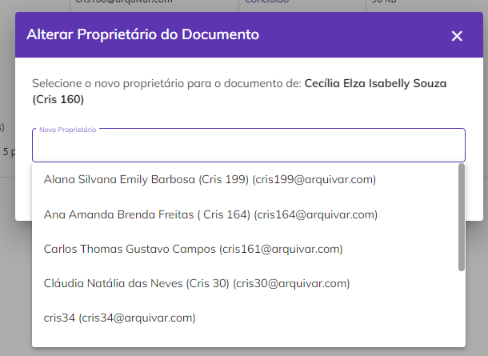<figcaption></figcaption></figure>

**Baixar Arquivo:** Utilizado para fazer o download do documento.

**Baixar Registro de Assinaturas:** Utilizado para fazer o download do registro das assinaturas realizadas no documento. O Registro de Assinaturas exibe todas as informações sobre as assinaturas eletrônicas e digitais realizadas, como nome dos signatários, data e hora da assinatura, localização, IP de onde foi realizada, dados dos certificados digitais utilizados etc.

<figure>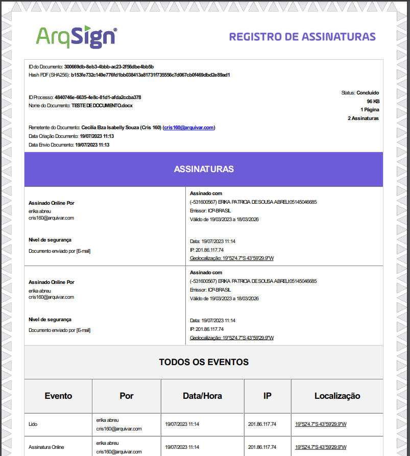<figcaption>
Clique na imagem para ampliar.
</figcaption></figure>

**Cancelar:** Esta opção só será exibida se o usuário além de signatário for também o remetente do documento. Ao clicar nesta opção o documento é cancelado e o processo de assinaturas é interrompido. Essa opção não será exibida se o status do documento for “Concluído”.

**Histórico:** Utilizado para visualizar informações sobre o documento e o histórico dos eventos relacionados a ele. Também é possível fazer o download dos arquivos originais do processo, antes das assinaturas concluídas. Essa opção só estará disponível para documentos com o status “Concluído”.

<figure>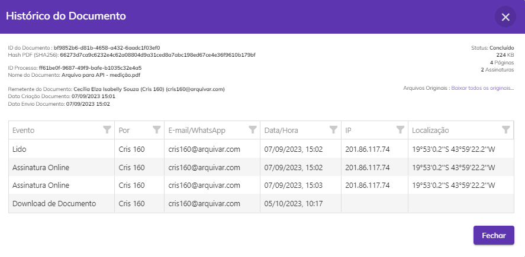<figcaption>
Clique na imagem para ampliar.
</figcaption></figure>

**Compartilhar:** Essa opção permite que o usuário crie um link de acesso ao documento que poderá ser compartilhado com outras pessoas que não sejam participantes do processo de assinatura. Esse link pode ter prazo de validade determinado ou indeterminado e o usuário pode definir se deseja permitir que as pessoas que acessarem visualizem também os anexos enviados pelos signatários.

<figure>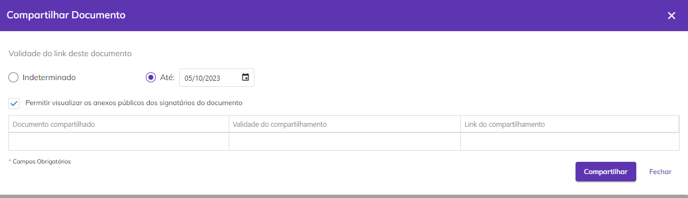<figcaption>
Clique na imagem para ampliar.
</figcaption></figure>

**Alterar Agendamento da Renovação:** Esta opção só será exibida se o usuário além de signatário for também o remetente do documento. Utilizada para alterar ou incluir um prazo de renovação do documento estipulado anteriormente no menu [Novo Documento > Adicionar Documentos](../menu-superior/novo-documento.md#a.-adicionar-documentos).

<figure>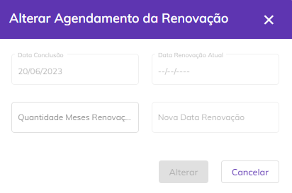<figcaption>
Clique na imagem para ampliar.
</figcaption></figure>

**Recusar Assinatura:** Disponível somente se o documento ainda não tiver sido assinado pelo signatário e seja a sua vez de assinar de acordo com a ordem estabelecida pelo remetente, se houver. Utilizado quando por algum motivo o signatário não deseja assinar o documento. Neste caso ele deve inserir uma justificativa para a recusa e clicar em “Recusar Assinatura”.

<figure>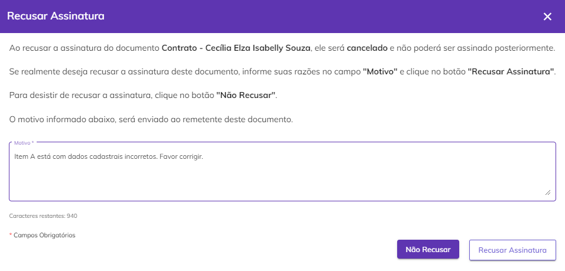<figcaption>
Clique na imagem para ampliar.
</figcaption></figure>

**Reenviar:** Esta opção só será exibida se o usuário além de signatário for também o remetente do documento e se o documento estiver vencido, ou seja, o prazo de assinatura terminou antes que todos os signatários tenham assinado. Ao clicar neste botão serão exibidas as informações de ordem de envio para os destinatários, e-mail ou telefone para onde o documento foi enviado, código de segurança para acesso ao documento (se houver) e ícone “Editar”, que permite a edição das informações do destinatário.

<figure>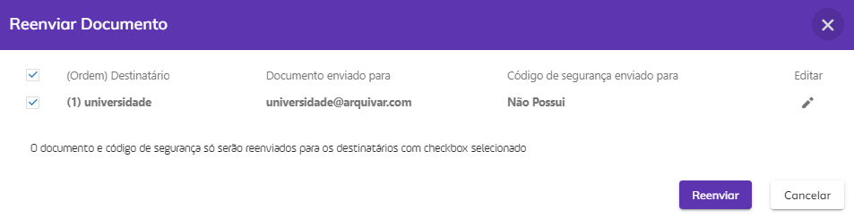<figcaption>
Clique na imagem para ampliar.
</figcaption></figure>

**Renomear:**  Esta opção só será exibida se o usuário além de signatário for também o remetente do documento. Utilizado para renomear o documento.

<figure>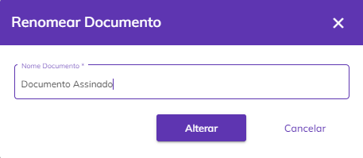<figcaption>
Clique na imagem para ampliar.
</figcaption></figure>

**Excluir:** Utilizado para excluir o arquivo, que irá para a caixa [Excluídos](excluidos.md) .

<figure>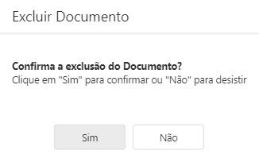<figcaption>
Clique na imagem para ampliar.
</figcaption></figure>

***

## Ações em lote - Caixa de Entrada

É possível selecionar mais de um documento marcando-se os checkbox ao lado do nome do arquivo e executar ações em lote. As ações em lote só poderão ser executadas em documentos em que o usuário for além de signatário o remetente do documento.

<figure>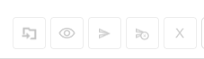<figcaption>
Clique na imagem para ampliar.
</figcaption></figure>

**Mover Documento:** Ao clicar neste ícone será possível alterar a pasta onde os documentos selecionados estão armazenados. Só será possível executar essa ação em documentos em que o usuário for além de signatário o remetente do documento.   &#x20;

<figure><figcaption></figcaption></figure>

**Reenviar:** Ao clicar neste ícone será possível reenviar os documentos selecionados para os destinatários que ainda não assinaram. Só será possível executar essa ação em documentos em que o usuário for além de signatário o remetente do documento e que não estejam com o status “Concluído”.

<figure>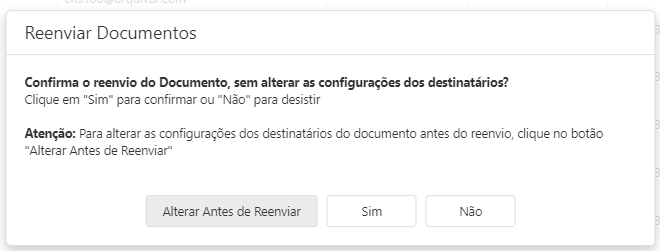<figcaption>
Clique na imagem para ampliar.
</figcaption></figure>

**Cancelar Envio:** Ao clicar neste ícone será possível cancelar o envio dos documentos selecionados, interrompendo os processos de assinatura. Só será possível executar essa ação em documentos em que o usuário for além de signatário o remetente do documento e que não estejam com o status “Concluído”.

<figure>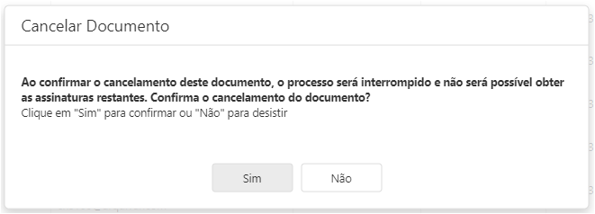<figcaption>
Clique na imagem para ampliar.
</figcaption></figure>

**Excluir:** Ao clicar neste ícone será possível excluir os documentos selecionados. Só será possível executar essa ação em documentos em que o usuário for além de signatário o remetente do documento e que estejam com o status “Concluído”.

<figure>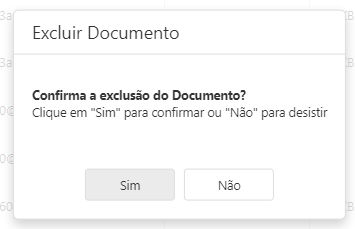<figcaption></figcaption></figure>

