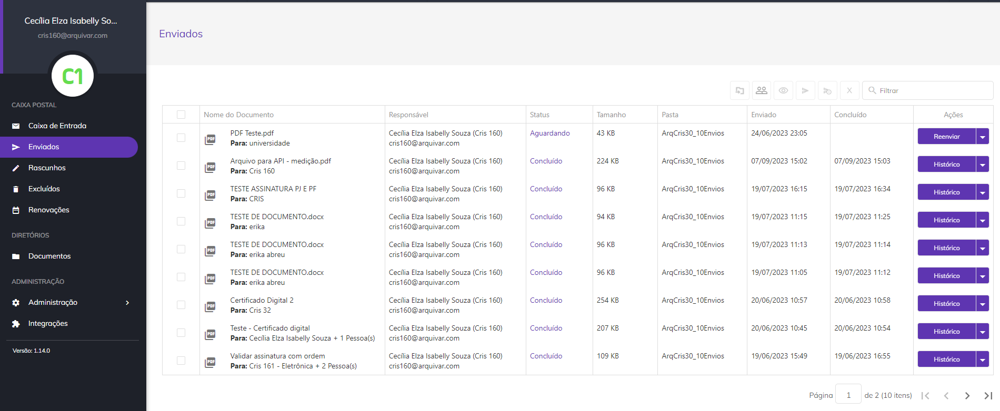
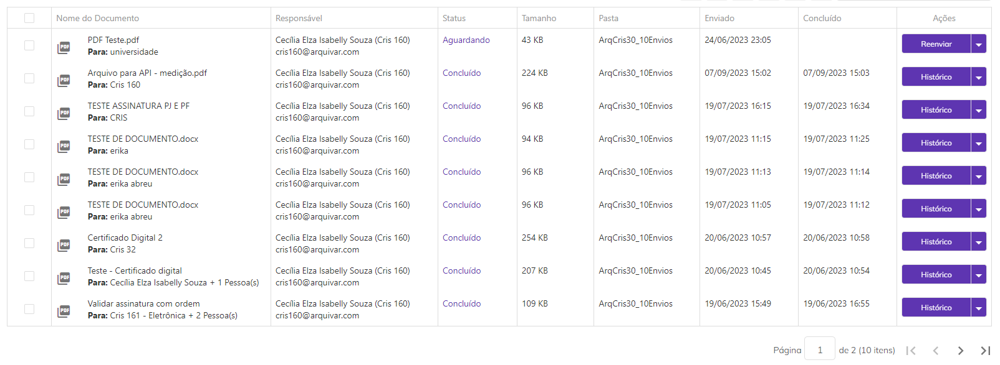
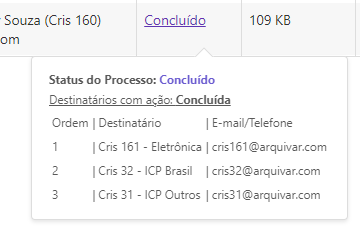
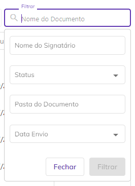
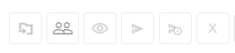
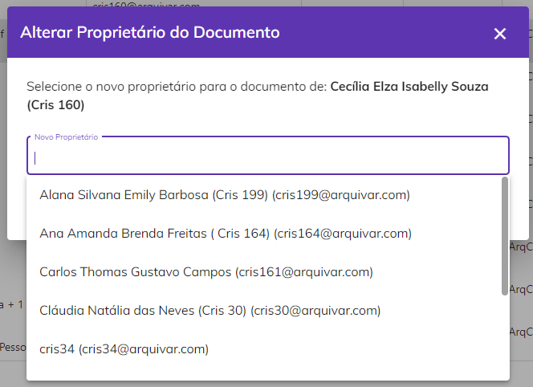
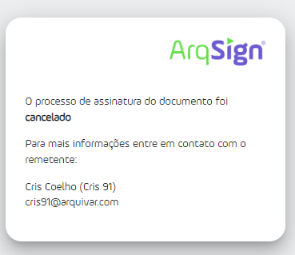
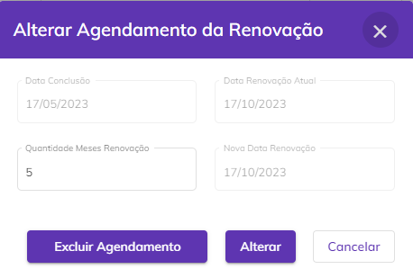
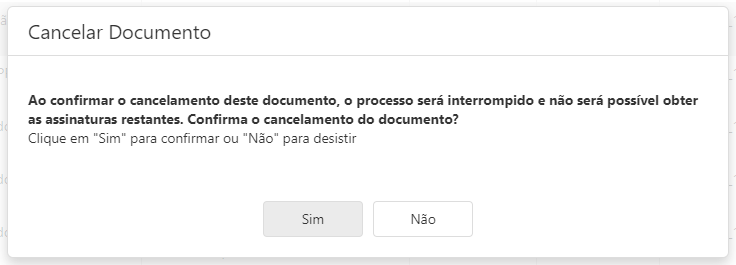

# 📩 Enviados

Na caixa Enviados são apresentados todos os documentos enviados pelo usuário para os signatários, inclusive aqueles em que ele mesmo é assinante.

<figure><figcaption></figcaption></figure>

Ao clicar em um documento, será aberta a tela de visualização do documento, que apresenta o documento enviado, seus status e data de vencimento. No canto direito da tela são apresentadas informações dos signatários como dados pessoais, papel de signatário e status da assinatura.

<figure><figcaption></figcaption></figure>

***

## Colunas da tela principal - Enviados

<figure><figcaption></figcaption></figure>

**Coluna Nome do Documento:** Nesta coluna são exibidos o nome do documento e o nome do signatário. Se houver mais de um signatário será mostrado o nome do primeiro e a quantidade de outras pessoas que deverão assinar.

**Coluna Responsável:** Nesta coluna são apresentados o nome e e-mail de quem enviou o documento (remetente). Na tela Enviados o único nome e e-mail apresentados serão os do próprio usuário.

**Coluna Status:** Os status possíveis para um documento são: “Aguardando” (nenhum participante assinou o documento até o momento), “Em processo” (um ou mais participantes já assinaram o documento, mas ainda faltam assinaturas), “Concluído” (todos os participantes já assinaram o documento) e “Cancelado” (o documento teve o envio cancelado e o processo de assinatura foi interrompido). Ao passar o mouse sobre o status são exibidas informações sobre quais signatários ainda estão com assinatura pendente e quais já concluíram, além dos dados desses signatários. Também é exibido o código de segurança enviado para os destinatários (se houver).

<figure><figcaption></figcaption></figure>

**Coluna Tamanho:** Nesta coluna é exibido o tamanho do arquivo do documento.&#x20;

**Coluna Pasta:** Nesta coluna é exibida a pasta do diretório onde o documento está armazenado. Caso o usuário não tenha permissão de acesso à pasta, será exibido “Sem pasta”.

**Coluna Enviado:** Informações sobre a data e hora em que o documento foi enviado.

**Coluna Concluído:** Informações sobre a data e hora em que o processo de assinatura do documento foi concluído. Caso ainda não tenha sido concluído esta coluna ficará em branco.

**Coluna Ações:** Esta coluna exibe botões de ação sobre o documento. Esses botões serão exibidos de acordo com o perfil do usuário. Será sempre exibida nesse botão a ação prioritária de execução, de acordo com o perfil do usuário e status do documento.

**Barra de filtro:** É possível localizar um ou mais documentos utilizando-se os filtros disponíveis para busca. A busca pode ser feita pelo nome ou e-mail do responsável pelo envio, pelo nome de um dos signatários, pelo status do documento (na caixa Enviados serão exibidos os documentos com status “Concluído”, Aguardando”, “Em processo” e “Cancelado”), pela pasta onde o documento está armazenado ou pela data de conclusão das assinaturas.

<figure><figcaption></figcaption></figure>

***

## Ações em lote - Enviados

É possível selecionar mais de um documento marcando-se os checkbox ao lado do nome do arquivo e executar ações em lote.

<figure><figcaption></figcaption></figure>

**Mover Documento:** Ao clicar neste ícone será possível alterar a pasta onde os documentos selecionados estão armazenados. Não será possível executar essa ação em documentos com o status “Em andamento”.   &#x20;

<figure><figcaption></figcaption></figure>

**Alterar Proprietário:** Ao clicar neste ícone será possível alterar a propriedade dos documentos selecionados, ou seja, as funções de administração do documento serão de outro usuário. Essa ação só poderá ser desfeita se o usuário que for definido como novo proprietário devolver a propriedade do documento ao proprietário original. A alteração de proprietário de um documento em lote tem o prazo de 24 horas para ser realizada e para acompanhar o andamento o usuário deve acessar o menu [Meu Perfil > Aba Solicitações](../menu-superior/meu-perfil.md).


<mark style="color:orange;">**Só podem ser selecionados como novo proprietários usuários cadastrados na mesma conta do responsável.**</mark>


<figure><figcaption></figcaption></figure>

**Reenviar:** Ao clicar neste ícone será possível reenviar os documentos selecionados para os destinatários que ainda não assinaram. Só será possível executar essa ação em documentos que não estejam com o status “Concluído”.

<figure><figcaption></figcaption></figure>

**Cancelar Envio:** Ao clicar neste ícone será possível cancelar o envio dos documentos selecionados, interrompendo os processos de assinatura. Só será possível executar essa ação em documentos que não estejam com o status “Concluído”.

<figure><figcaption></figcaption></figure>

<figure><figcaption></figcaption></figure>

**Excluir:** Ao clicar neste ícone será possível excluir os documentos selecionados. Só será possível executar essa ação em documentos com o status “Concluído” ou “Cancelado”.

<figure><figcaption></figcaption></figure>

***

## Ações individuais - Enviados

**Reenviar:** Os documentos que já estão com prazo de assinatura expirado e que não foram assinados por todos os signatários exibirão a mensagem “Vencido antes da conclusão das assinaturas”. Neste caso, é possível reenviar o documento para aqueles signatários que ainda não assinaram. Ao clicar neste botão serão exibidas as informações de ordem de envio para os destinatários, e-mail ou telefone para onde o documento foi enviado, código de segurança para acesso ao documento (se houver) e ícone “Editar”, que permite a edição das informações do destinatário.

<figure><figcaption></figcaption></figure>

**Histórico:** Utilizado para visualizar informações sobre o documento e o histórico dos eventos relacionados a ele. Também é possível fazer o download dos arquivos originais do processo, antes das assinaturas concluídas. Essa opção só estará disponível para documentos com o status “Concluído”.

<figure><figcaption></figcaption></figure>

**Alterar Pasta:** Esta opção só será exibida se o usuário tiver acesso à conta na qual o documento está armazenado. Ao clicar nesta opção ele poderá alterar a pasta do diretório onde o documento está armazenado.

<figure><figcaption></figcaption></figure>

**Alterar Proprietário:** Ao clicar nesta opção ele poderá alterar o proprietário do documento. Ao executar essa ação não será possível realizar outras atividades de gestão do documento.


<mark style="color:orange;">**Só podem ser selecionados como novo proprietários usuários cadastrados na mesma conta do responsável.**</mark>


<figure><figcaption></figcaption></figure>

**Alterar Renovação:** Esta opção só estará disponível caso o documento possua status “Concluído”. Ao clicar nesta opção é possível incluir ou alterar a data de renovação do documento, determinada anteriormente no campo “Agendar renovação \_\_\_ meses após a conclusão das assinaturas” marcada, na tela Novo Documento > Adicionar Documentos e Destinatários > Adicionar Documentos. É possível também altear ou definir a quantidade de meses de intervalo entre as renovações no campo “Quantidade Meses Renovação”. &#x20;

<figure><figcaption></figcaption></figure>

**Baixar Arquivo:** Utilizado para fazer o download do documento.

**Baixar Registro de Assinaturas:** Utilizado para fazer o download do registro das assinaturas realizadas no documento. O Registro de Assinaturas exibe todas as informações sobre as assinaturas eletrônicas realizadas, como nome dos assinantes, data e hora da assinatura, localização e IP de onde foi realizada, dados dos certificados digitais utilizados etc.

<figure><figcaption></figcaption></figure>

**Corrigir:** Será exibido esse botão quando a informação de contato (e-mail ou telefone) para envio do documento de um ou mais signatários estiver incorreta. Nesse caso será necessário corrigir a informação incorreta para que o sistema reenvie o documento. &#x20;

**Cancelar:** Ao clicar nesta opção o documento é cancelado e o processo de assinaturas é interrompido.

<figure><figcaption></figcaption></figure>

**Excluir:** Utilizado para excluir o arquivo, que irá para a caixa [Excluídos](excluidos.md).

<figure><figcaption></figcaption></figure>

**Renomear:**  Esta opção só será exibida se o usuário além de signatário for também o remetente do documento. Utilizado para renomear o documento.

<figure><figcaption></figcaption></figure>

