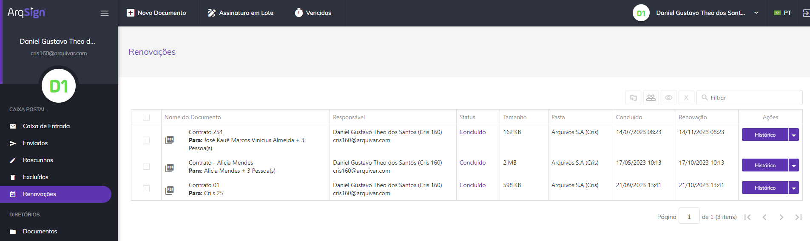
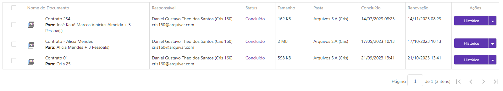
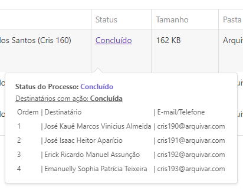
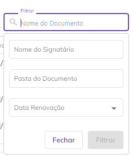
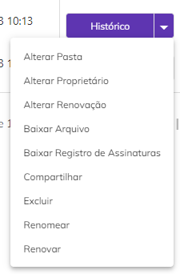
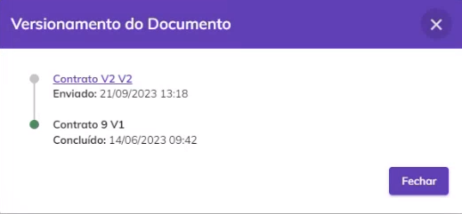
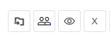

# 🗓 Renovações

No menu Renovações são apresentados todos os documentos que foram cadastrados e enviados para assinatura com a opção “Agendar renovação \_\_\_ meses após a conclusão das assinaturas” marcada, na tela [Novo Documento > Adicionar Documentos e Destinatários > Adicionar Documentos](../menu-superior/novo-documento.md#a.-adicionar-documentos). Só podem ser exibidos nesta tela documentos com o status “Concluído”.

<figure><figcaption></figcaption></figure>

***

## Colunas da tela principal - Renovações

<figure><figcaption></figcaption></figure>

**Coluna Nome do Documento:** Nesta coluna são exibidos o nome do documento e o nome do signatário. Se houver mais de um signatário será mostrado o nome do primeiro e a quantidade de outras pessoas que deverão assinar.&#x20;

**Coluna Responsável:** Nesta coluna são apresentados o nome e e-mail de quem enviou o documento (remetente). Na tela Renovações o único nome e e-mail apresentados serão os do próprio usuário.&#x20;

**Coluna Status:** Na tela Renovações o único status possível para um documento é “Concluído” (todos os participantes já assinaram o documento). Ao passar o mouse sobre o status são exibidas informações sobre os signatários. Também é exibido o código de segurança enviado para os destinatários (se houver).&#x20;

<figure><figcaption></figcaption></figure>

**Coluna Tamanho:** Nesta coluna é exibido o tamanho do arquivo do documento.  &#x20;

**Coluna Pasta:** Nesta coluna é exibida a pasta do diretório onde o documento está armazenado. &#x20;

**Coluna Concluído:** Informações sobre a data e hora em que o processo de assinatura do documento foi concluído. &#x20;

**Coluna Renovação:** Esta coluna exibe a data e hora em que o documento deverá ser renovado, de acordo com a informação inserida no campo “Agendar renovação \_\_\_ meses após a conclusão das assinaturas” marcada, na tela [Novo Documento > Adicionar Documentos e Destinatários > Adicionar Documentos](../menu-superior/novo-documento.md#a.-adicionar-documentos). São exibidos tanto documentos que têm data futura de renovação quanto aqueles que já passaram do prazo, mas ainda não foram renovados.&#x20;

**Coluna Ações:** Esta coluna exibe botões de ação sobre o documento. Será sempre exibida nesse botão a ação prioritária de execução, de acordo com o perfil do usuário e status do documento.&#x20;

**Barra de filtro:** É possível localizar um ou mais documentos utilizando-se os filtros disponíveis para busca. Na tela Renovações a busca pode ser feita pelo nome do documento, pelo nome do responsável, pelos nomes dos signatários, pelo status do documento, pela pasta onde o documento está hospedado ou pela data de exclusão do documento.  &#x20;

<figure><figcaption></figcaption></figure>

***

## Ações individuais - Renovações

<figure><figcaption></figcaption></figure>

**Renovar:** Esta ação estará disponível caso o documento tenha alcançado a data e hora programados para sua programação no campo “Agendar renovação \_\_\_ meses após a conclusão das assinaturas” marcada, na tela [Novo Documento > Adicionar Documentos e Destinatários > Adicionar Documentos.](../menu-superior/novo-documento.md#a.-adicionar-documentos) Ao clicar neste botão o usuário será direcionado para a tela de cadastro do documento para que faça novamente a configuração e envio do documento para os destinatários.&#x20;


<mark style="color:orange;">**Mesmo depois de renovar o documento e enviá-lo aos destinatários, o documento será listado na tela Renovações até que todos os signatários concluam a assinatura.**</mark> &#x20;


**Alterar Pasta:** Ao clicar nesta opção ele poderá alterar a pasta do diretório onde o documento está armazenado. &#x20;

<figure><figcaption></figcaption></figure>

**Alterar Renovação**: Essa opção só estará disponível caso o documento ainda não tenha atingido o prazo de renovação estipulado em seu cadastro. Ao clicar nesta opção será possível mudar a data renovação informando a quantidade de meses que deverá ter o intervalo de renovação do documento. Também é possível excluir a renovação clicando em “Excluir Agendamento”.&#x20;

<figure><figcaption></figcaption></figure>

**Histórico:** Utilizado para visualizar informações sobre o documento e o histórico dos eventos relacionados a ele. Também é possível fazer o download dos arquivos originais do processo, antes das assinaturas concluídas. Essa opção só estará disponível para documentos com o status “Concluído”.&#x20;

<figure><figcaption></figcaption></figure>

**Alterar Proprietário:** Ao clicar nesta opção ele poderá alterar o proprietário do documento. Ao executar essa ação não será possível realizar outras atividades de gestão do documento.&#x20;


<mark style="color:orange;">**Só podem ser selecionados como novo proprietários usuários cadastrados na mesma conta do responsável.**</mark>&#x20;


<figure><figcaption></figcaption></figure>

**Baixar Arquivo:** Utilizado para fazer o download do documento.&#x20;

**Baixar Registro de Assinaturas:** Utilizado para fazer o download do registro das assinaturas realizadas no documento. O Registro de Assinaturas exibe todas as informações sobre as assinaturas eletrônicas realizadas, como nome dos assinantes, data e hora da assinatura, localização e IP de onde foi realizada, dados dos certificados digitais utilizados etc. &#x20;

<figure><figcaption></figcaption></figure>

**Compartilhar:** Essa opção permite que o usuário crie um link de acesso ao documento que poderá ser compartilhado com outras pessoas que não sejam participantes do processo de assinatura. Esse link pode ter prazo de validade determinado ou indeterminado e o usuário pode definir se deseja permitir que as pessoas que acessarem visualizem também os anexos enviados pelos signatários. &#x20;

<figure><figcaption></figcaption></figure>

**Excluir:** Utilizado para excluir o arquivo, que irá para a [caixa Excluídos](excluidos.md).&#x20;

<figure><figcaption></figcaption></figure>

**Renomear:** Esta opção só será exibida se o usuário além de signatário for também o remetente do documento. Utilizado para renomear o documento. &#x20;

<figure><figcaption></figcaption></figure>

**Versionamento:** Essa opção permite ao usuário visualizar todas as versões do documento que já foram enviadas. Ao renovar um documento e ele ser concluído, ele deixa de ser exibido na tela Renovações, mas as informações sobre o seu envio podem ser vistas na tela Versionamento do Documento. &#x20;

<figure><figcaption></figcaption></figure>

***

## Ações em lote - Renovações

É possível selecionar mais de um documento marcando-se os checkbox ao lado do nome do arquivo e executar ações em lote.&#x20;

<figure><figcaption></figcaption></figure>

**Mover Documento:** Ao clicar neste ícone será possível alterar a pasta onde os documentos selecionados estão armazenados. &#x20;

<figure><figcaption></figcaption></figure>

**Alterar Proprietário:** Ao clicar neste ícone será possível alterar a propriedade dos documentos selecionados, ou seja, as funções de administração do documento serão de outro usuário. Essa ação só poderá ser desfeita se o usuário que for definido como novo proprietário devolver a propriedade do documento ao proprietário original. A alteração de proprietário de um documento em lote tem o prazo de 24 horas para ser realizada e para acompanhar o andamento o usuário deve acessar o menu Meu Perfil > Aba Solicitações. &#x20;


<mark style="color:orange;">**Só podem ser selecionados como novo proprietários usuários cadastrados na mesma conta do responsável.**</mark>&#x20;


<figure><figcaption></figcaption></figure>

**Excluir:** Ao clicar neste ícone será possível excluir os documentos selecionados. Só será possível executar essa ação em documentos com o status “Concluído” ou “Cancelado”.&#x20;

<figure><figcaption></figcaption></figure>
