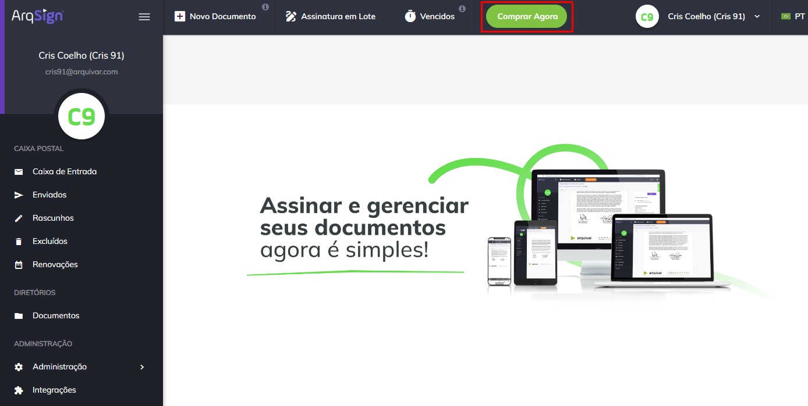
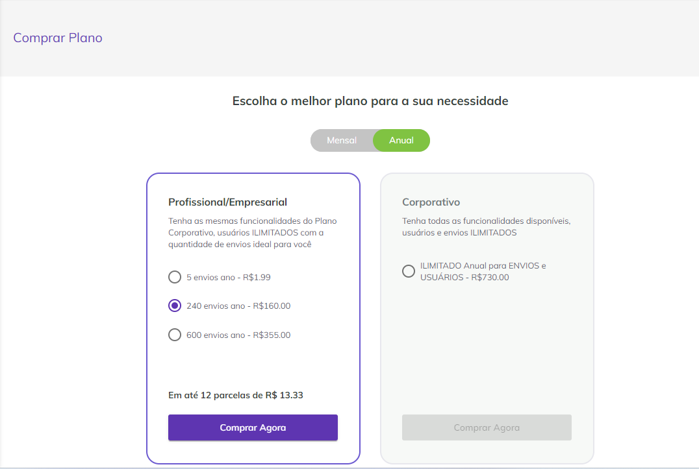
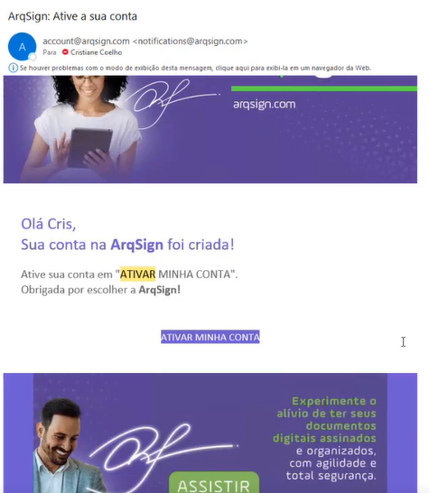
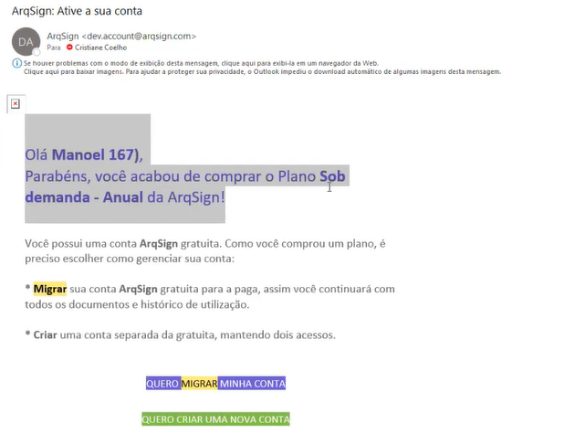

# 🛒 Comprar ou Alterar Plano

Os botões “Comprar Agora” ou “Alterar Plano” serão exibidos para usuários que possuem uma conta de teste grátis ou para usuários que possuam plano pago expirado ou próximo da data de expiração. Neste caso, o usuário pode escolher permanecer no plano em que está ou migrar para outro plano. &#x20;

O botão “Comprar Agora” será exibido para usuários da Conta teste grátis ou usuários com a assinatura do plano expirada.&#x20;

O botão “Alterar Plano” será exibido para usuários com assinatura de plano pago com data de vencimento próxima (30 dias antes da expiração de planos anuais e 10 dias antes da expiração de planos mensais).&#x20;

1\. Para comprar um plano ou alterar o seu plano clique em “Comprar Agora” ou “Alterar plano”. Selecione o plano ideal para o seu negócio, preencha os dados para pagamento e clique em “Finalizar a compra”.

<figure><figcaption>
Clique na imagem para ampliar.
</figcaption></figure>


<mark style="color:orange;">**Caso o usuário tenha deixado marcada a opção “Renovação Automática” na tela**</mark> [<mark style="color:blue;">**Administração > Conta > Aba Faturamento e Uso > Plano e Consumo**</mark>](../administracao/administracao/conta.md#plano-e-consumo)<mark style="color:orange;">**, o botão “Comprar Plano” não será exibido, porque ao expirar o plano, o sistema manterá o usuário no plano que possui e renovará o pagamento automaticamente, utilizando as informações de faturamento já existentes no cadastro do usuário.**</mark> &#x20;


<figure><figcaption></figcaption></figure>

2\. Ao realizar a compra, o sistema verificará se o e-mail informado tem vínculo com alguma conta grátis. Se não tiver, será enviado ao usuário uma notificação para que ele ative sua conta. &#x20;

<figure><figcaption></figcaption></figure>

3\. Caso sua conta anterior seja grátis, ele terá a opção de migrar para um plano pago ou criar uma nova conta, mantendo dois acessos.&#x20;

<figure><figcaption></figcaption></figure>

4\. Se a conta for compartilhada com outros usuários, todos os usuários com perfil de administrador global da conta receberão uma notificação por e-mail sobre a alteração ou renovação do plano. &#x20;
