# ➕ Novo Documento

Na tela Novo Documento o usuário poderá cadastrar um ou mais documentos que será(ão) enviado(s) a signatários para assinatura.

## Etapa 1: Adicionar Documentos e Destinatários

### A. Adicionar Documentos

#### **Configurações Avançadas**

As configurações avançadas são configurações relativas ao documento.

* **Tempo para expiração do documento após o envio:** Neste campo o usuário deve informar o prazo (em dias) de expiração do documento, ou seja, o limite para que os destinatários o assinem.


<mark style="color:orange;">**Caso esse campo não seja alterado, será preenchido com o valor padrão. O valor padrão do sistema é de 120 dias, mas esse valor pode ser alterado no menu Administração > Conta > Configurações.**</mark>


* **Aviso antes da expiração:** Neste campo deve ser informado o prazo (em dias) em que o sistema deverá enviar aos destinatários que ainda não assinaram um aviso sobre a expiração do documento.&#x20;
* **Ativar lembretes:** Ao ativar essa opção o sistema enviará aos destinatários lembretes para que realizem a assinatura do documento. Esses lembretes serão enviados apenas para os signatários que ainda não assinaram o documento. Por padrão essa opção estará marcada.
* **Enviar lembretes aos destinatários a cada:** Neste campo deve ser informado de quanto em quanto tempo (em dias) o sistema deverá enviar os lembretes de assinatura aos destinatários que ainda não assinaram.
* **Gerar QRCode de acesso do documento no Registro de Assinaturas:** Ao ativar essa opção será gerado um QRCode no documento de registro de assinaturas. Por padrão essa opção estará desmarcada.

<figure>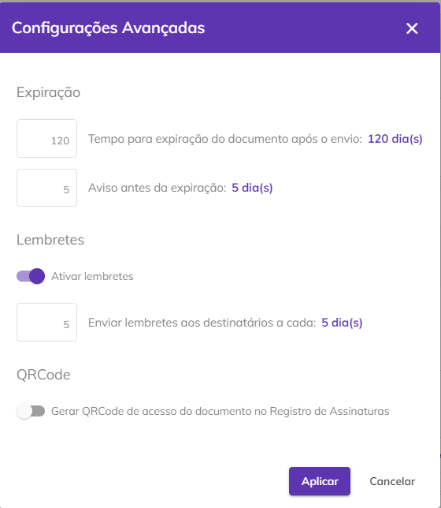<figcaption></figcaption></figure>

Para incluir o documento que deverá ser assinado, selecione ou arraste o arquivo desejado até o campo de inclusão do documento. Pode ser incluído mais de um arquivo.


<mark style="color:orange;">**São permitidos arquivos das seguintes extensões:**</mark>

<mark style="color:orange;">**Documento: .doc, .docx, .pdf, .txt.**</mark>

<mark style="color:orange;">**Imagem: .jpg, .jpeg, .png, .tif, .tiff**</mark>&#x20;

<mark style="color:orange;">**Apresentação: .ppt, .pptx**</mark>&#x20;

<mark style="color:orange;">**Planilha: .csv, .xls, .xlsx**</mark>


<figure>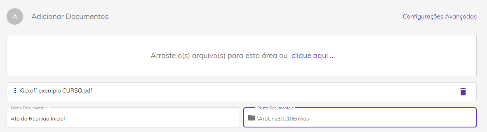<figcaption></figcaption></figure>

No campo “**Nome Documento**” edite o nome do documento. Para excluir um arquivo depois de realizado o upload, clique no ícone “Excluir” ao lado do nome do arquivo.

<figure>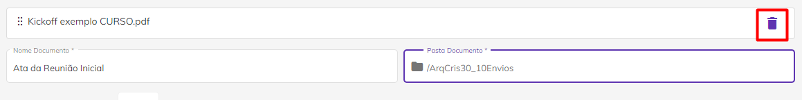<figcaption></figcaption></figure>

No campo “**Pasta Documento**” selecione a pasta na qual o documento será hospedado. As pastas nas quais os documentos poderão ser armazenados deverão ser criadas no menu [Diretórios > Documentos.](../diretorios/documentos.md) Por padrão uma pasta com o nome do usuário é criada e deve ser selecionada caso não exista nenhuma outra.

<figure>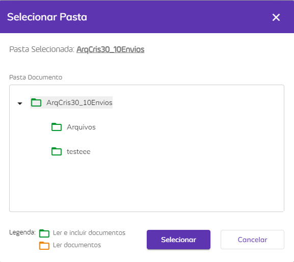<figcaption></figcaption></figure>

Para agendar a renovação do documento que está sendo cadastrado de forma automática, selecione o checkbox do campo “**Agendar renovação \_\_\_ meses após a conclusão das assinaturas**” informando a quantidade de meses em que deseja que o documento seja renovado. Assim que as assinaturas do primeiro envio forem concluídas, o sistema passará a contar o prazo determinado e quando o período de renovação for atingido, o responsável pelo documento (remetente) receberá uma notificação informando que o documento está apto a ser renovado.

<figure>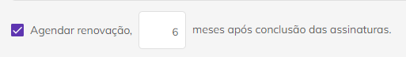<figcaption></figcaption></figure>

### B. Destinatários

No campo “Destinatários” preencha os campos relativos aos usuários que receberão o documento e participarão do processo de assinatura. É preciso realizar as configurações descritas a seguir para cada um dos destinatários.

Para adicionar um destinatário salvo na lista de contatos, clique no ícone “**Adicionar destinatário a partir dos meus contatos**”. A lista de contatos deve ser criada anteriormente no menu [Meu Perfil.](meu-perfil.md)

<figure>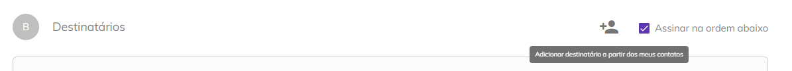<figcaption></figcaption></figure>

Ao clicar neste botão é exibida a lista. Para adicionar os destinatários desejados, selecione-os clicando no checkbox ao lado do nome e clique em “Adicionar Destinatários”.

<figure>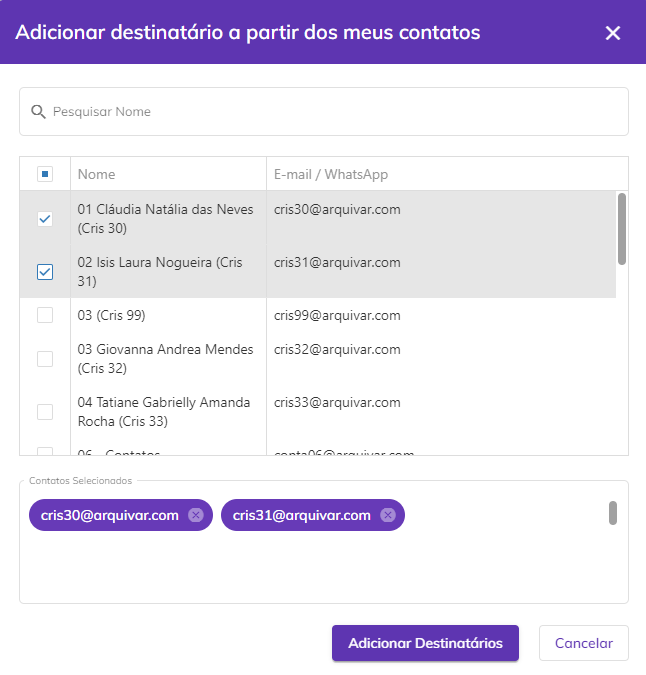<figcaption></figcaption></figure>

Ao marcar o checkbox “**Assinar na ordem abaixo**” o documento será enviado aos destinatários na ordem definida no campo “**Ordem**” que aparecerá na parte superior de “Dados do Destinatário”. Ao definir essa opção um usuário só receberá o documento quando o anterior concluir sua ação de assinatura ou visualização. Informe também o nome do destinatário.

<figure>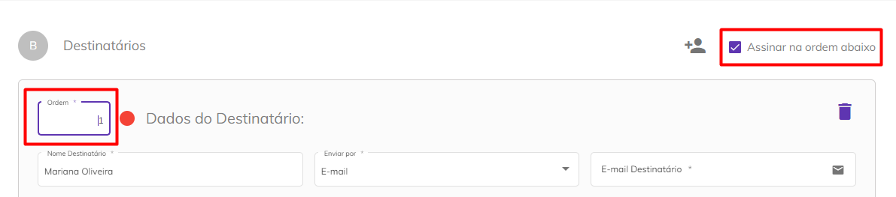<figcaption></figcaption></figure>

**Enviar por:** Selecione se o documento será enviado por e-mail ou Whatsapp para o destinatário.


<mark style="color:orange;">**A opção de envio por Whatsapp só será exibida se o plano do usuário contemplar esse tipo de envio.**</mark>


Dependendo da opção escolhida anteriormente, informe o e-mail ou número de telefone do destinatário para envio do documento.

<figure>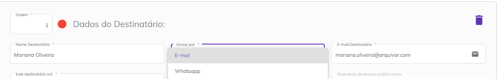<figcaption></figcaption></figure>

**Este destinatário irá:** Informe se o destinatário irá assinar o documento online como Pessoa Física, Jurídica ou ambas, ou se irá somente receber uma cópia do documento no fim do processo de assinaturas.

<figure>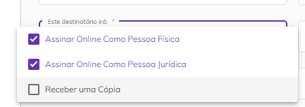<figcaption></figcaption></figure>

Caso tenha sido determinado que o destinatário irá assinar como pessoa física ou jurídica é preciso definir seu papel como signatário no processo. Selecione entre um ou mais papéis listados ou adicione um “Papel do Signatário” personalizado clicando em “Adicionar papel”.

Os papéis do signatário apresentados aqui são anteriormente criados no menu [Administração > Conta > Aba Configurações > Papel do Signatário](../administracao/administracao/conta.md#papel-do-signatario). Por padrão a plataforma apresenta os papéis “Contratada”, “Contratante”, “Fiador”, “Parte” e “Testemunha”, mas é possível editar ou excluir esses papéis, além de criar outros se necessário.

<figure>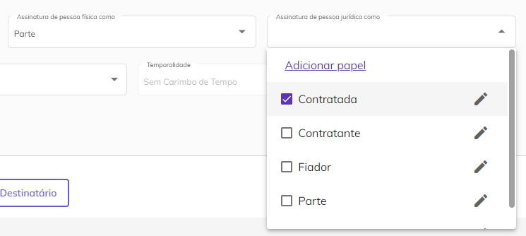<figcaption></figcaption></figure>

 

<figure>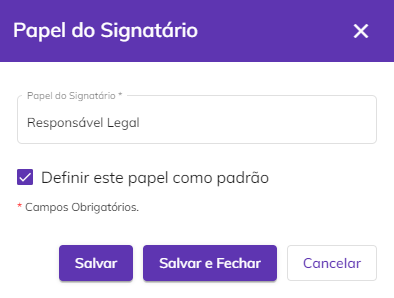<figcaption></figcaption></figure>

**Tipo de Assinatura:** Selecione se o destinatário deverá utilizar assinatura eletrônica ou um certificado digital para assinar o documento.

<figure>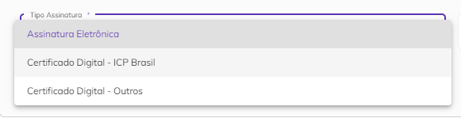<figcaption></figcaption></figure>


<mark style="color:blue;">**ASSINATURA ELETRÔNICA X ASSINATURA DIGITAL (ICP Brasil e ICP Outros)**</mark>

<mark style="color:blue;">**Assinatura eletrônica**</mark> <mark style="color:blue;"></mark><mark style="color:blue;">é aquela que não precisa de um certificado digital. É mais utilizada para assinar contratos e documentos entre entes privados (B2B, B2C).</mark>&#x20;

<mark style="color:blue;">**Assinatura digital**</mark> <mark style="color:blue;"></mark><mark style="color:blue;">é aquela que precisa de um certificado digital. É mais utilizada para emissão de notas fiscais e para transações com o governo.</mark>&#x20;

<mark style="color:blue;">Na Plataforma Arqsign, ao configurar um fluxo de assinaturas você pode determinar qual tipo de assinatura deverá ser executada por destinatário escolhendo entre:</mark>&#x20;

<mark style="color:blue;">**a) Assinatura eletrônica**</mark> <mark style="color:blue;"></mark><mark style="color:blue;">(a ArqSign produz assinaturas eletrônicas avançadas com validade jurídica de acordo com MP 2.200-2 de 24/08/2001 e Lei 14.063 de 23/11/2020). Sempre que um signatário assina um documento de forma eletrônica a Arqsign aplica um certificado digital próprio da plataforma, capturando o Hash (identificação única) do arquivo, verificando a integridade do arquivo e anexando ao certificado a identificação do signatário.</mark>  &#x20;

<mark style="color:blue;">**b) Assinatura digital – ICP-Brasil ou ICP Outros**</mark> <mark style="color:blue;"></mark><mark style="color:blue;">(A ArqSign produz assinaturas digitais qualificadas de acordo com MP 2.200-2 de 24/08/2001 e Lei 14.063 de 23/11/2020). Quando o usuário já possui um certificado digital e deseja utilizá-lo para realizar a assinatura por meio da ArqSign, este certificado é utilizado para verificar a integridade da assinatura e identificar o usuário como signatário no documento.</mark>&#x20;


**Temporalidade:** Selecione se o documento terá validade ou se será enviado sem carimbo de tempo.

<figure>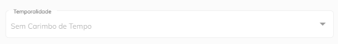<figcaption></figcaption></figure>

Ao marcar a opção **“Salvar este destinatário em minha lista de contatos”** os dados informados do destinatário serão salvos automaticamente na lista de contatos do usuário.

<figure>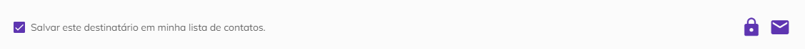<figcaption></figcaption></figure>

**Ícone “Código de Segurança”:** Ao clicar neste ícone poderá ser criado um código numérico que será enviado ao destinatário para que ele consiga acessar o documento. O código pode ser gerado automaticamente pelo sistema ou informado manualmente pelo usuário.

<figure>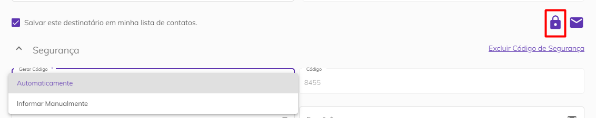<figcaption></figcaption></figure>

Depois de gerar o código escolha se ele será enviado por e-mail, Whatsapp ou SMS e informe o e-mail ou telefone para envio. Também é possível não enviar o código, deixando a cargo do usuário informá-lo ao destinatário da forma que preferir. Para excluir o código criado, basta clicar em “Excluir Código de Segurança”.

<figure>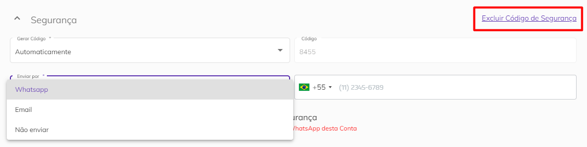<figcaption></figcaption></figure>

Se selecionada a opção de envio por Whatsapp é possível permitir que o destinatário solicite o reenvio do código, marcando a checkbox “**Permitir que este destinatário possa solicitar reenvio do código de segurança**”.


<mark style="color:orange;">**Cada reenvio do código de segurança solicitado pelo destinatário irá consumir um crédito de WhatsApp da conta do usuário que está enviando o documento.**</mark>


<figure>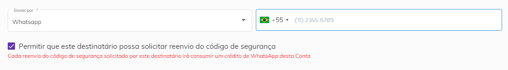<figcaption></figcaption></figure>

**Ícone Mensagem Personalizada:** Ao clicar neste ícone será possível inserir uma mensagem que será enviada ao destinatário junto com o documento. Para isso preencha os campos “Assunto” e “Mensagem”. Caso deseje excluir a mensagem, clique em “Excluir Mensagem Personalizada”.

<figure>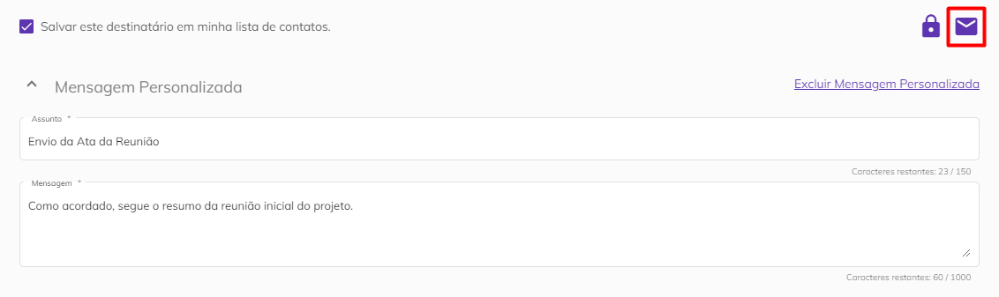<figcaption></figcaption></figure>

Para inserir outros destinatários clique no botão “Adicionar Novo Destinatário”.

Para incluir a si mesmo como destinatário, clique em “**Me adicionar como destinatário**”. Os campos de nome e e-mail serão preenchidos automaticamente com as informações cadastradas no seu perfil de usuário e o campo “Enviar por” será preenchido com a opção “E-mail”.

<figure>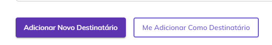<figcaption></figcaption></figure>

### C. Mensagem Padrão

No campo “Mensagem Padrão” deve ser definida a mensagem padrão que será enviada a todos os destinatários, preenchendo-se os campos “**Assunto**” e “**Mensagem**”.


<mark style="color:orange;">**No caso de destinatários que tiverem os campos de Mensagem Personalizada preenchidos será enviada a mensagem informada em substituição à mensagem padrão.**</mark>


<figure>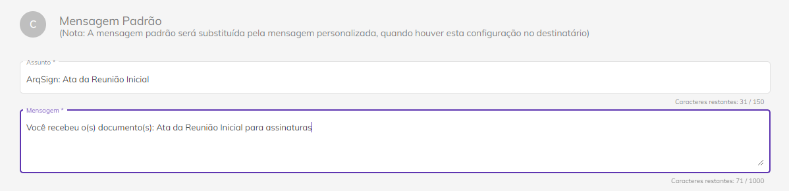<figcaption></figcaption></figure>

Depois de concluir essas configurações, clique em “Avançar” para seguir para a próxima etapa, “Concluir Mais Tarde” para salvar o documento como rascunho ou “Descartar” para cancelar o cadastro.

<figure>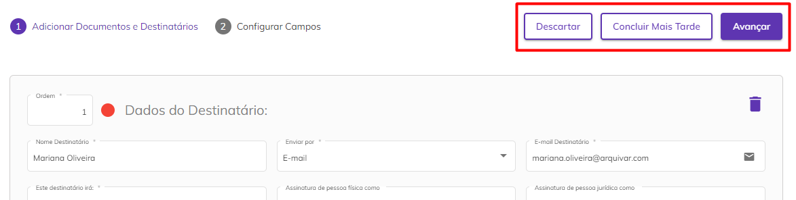<figcaption></figcaption></figure>

***

## Etapa 2: Configurar Campos

Na próxima etapa serão exibidos os documentos que foram inseridos na etapa anterior em formato PDF e deverão ser configuradas as áreas onde os participantes do processo deverão assinar.

<figure>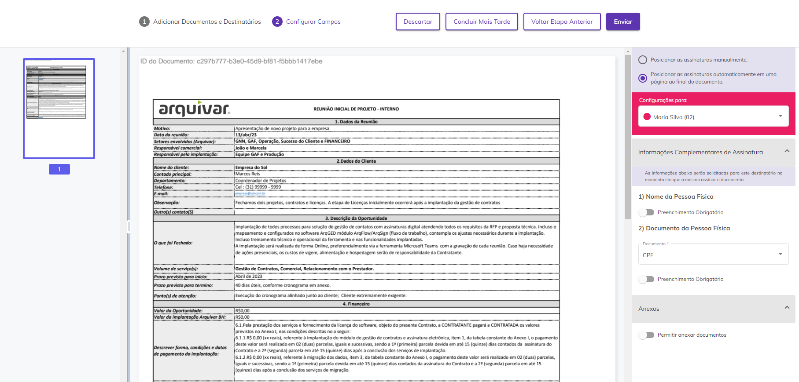<figcaption></figcaption></figure>

No canto direito da tela escolha entre “**Posicionar as assinaturas manualmente**” para escolher onde as áreas de assinatura serão posicionadas no documento ou “**Posicionar as assinaturas automaticamente em uma página ao final do documento**”, para que todas as assinaturas sejam inseridas no fim da última página do documento.  &#x20;

Para cada destinatário inserido na primeira etapa é preciso configurar a área de assinatura. Para isso, selecione o destinatário no campo “**Configurações para**”.

<figure>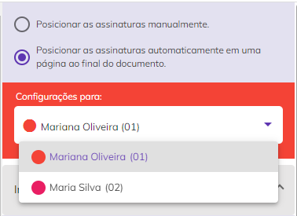<figcaption></figcaption></figure>

### Campos Assinatura

Caso tenha sido escolhida a opção “**Posicionar as assinaturas manualmente**”, será exibido o campo “**Campos Assinatura**”. Para criar a área de assinatura, arraste o quadro “Assinar como” para a parte do documento em que deseja que seja inserida a assinatura.

<figure>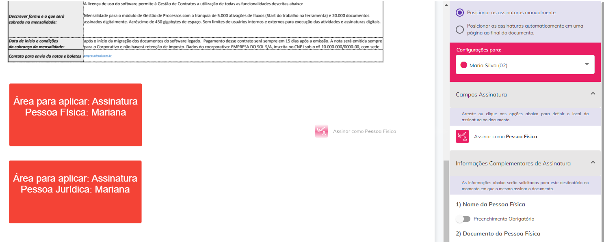<figcaption></figcaption></figure>

Caos tenha sido escolhida a opção “**Posicionar as assinaturas automaticamente em uma página ao final do documento**”, será inserida uma página no fim do documento na qual serão exibidas as assinaturas e informações dos signatários de forma ordenada. Também é exibido o papel que aquele signatário possui no contrato.

<figure>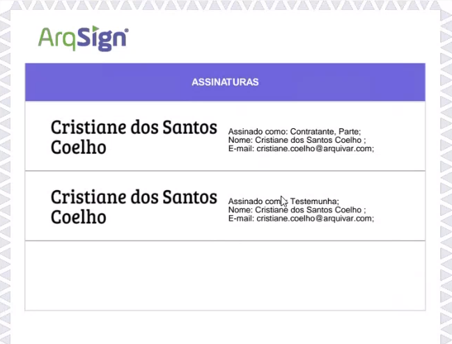<figcaption></figcaption></figure>

Se na [Etapa 1](novo-documento.md#b.-destinatarios) tiver sido definido que o destinatário irá assinar como pessoa física e jurídica, deverão ser inseridos dois quadros com seu nome na mesma cor.  Os quadros de cada um dos destinatários serão exibidos em cores diferentes para sinalizar visualmente onde cada um deverá assinar.


<mark style="color:orange;">**Perceba que os quadros dos destinatários são da mesma cor exibida no campo “Configurações para”.**</mark>


<figure>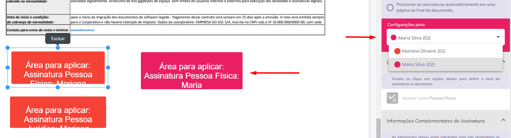<figcaption></figcaption></figure>

### Informações Complementares de Assinatura

Dependendo do tipo de assinatura definido para o destinatário na [Etapa 1](novo-documento.md#b.-destinatarios) serão exibidos os campos “**Informações Complementares de Assinatura**”. Esses campos só serão exibidos sena [Etapa 1 no campo “Tipo de Assinatura”](novo-documento.md#b.-destinatarios) tiver sido escolhida a opção “Assinatura Eletrônica”.

Se a assinatura for como Pessoa Física, é possível exigir do destinatário o seu nome e algum documento, marcando as opções “Nome da Pessoa Física” e “Documento da Pessoa Física” como de preenchimento obrigatório.

<figure>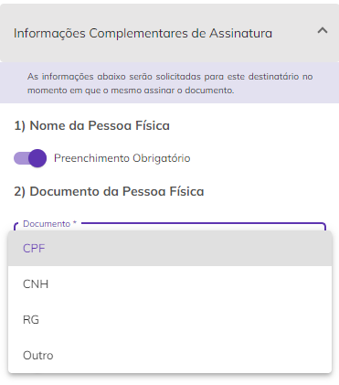<figcaption></figcaption></figure>

Para exigir um documento selecione a opção desejada entre CPF, CNH, RG ou outros. Se selecionada essa última opção será preciso informar o nome do documento, se é do tipo texto ou numérico e a quantidade de caracteres. &#x20;

<figure>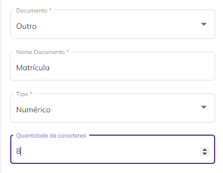<figcaption></figcaption></figure>

Se a assinatura for como Pessoa Jurídica, é possível exigir do destinatário a razão social da empresa e algum documento, marcando as opções “Razão Social da Pessoa Jurídica” e “Documento da Pessoa Jurídica” como de preenchimento obrigatório.

<figure>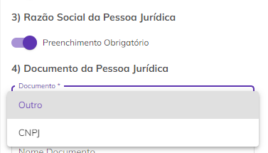<figcaption></figcaption></figure>

Para exigir um documento selecione a opção desejada entre CNPJ ou outros. Se selecionada essa última opção será preciso informar o nome do documento, se é do tipo texto ou numérico e a quantidade de caracteres. &#x20;

<figure><figcaption></figcaption></figure>

### Anexos

No campo “Anexos” do lado esquerdo da tela serão exibidas configurações que permitirão aos destinatários anexar outros arquivos ao documento no momento em que forem assinar. Para isso, marque a opção “**Permitir anexar documentos**”.

Informe o nome do anexo que será solicitado e defina se será de preenchimento obrigatório e se todos os destinatários participantes do fluxo de assinatura poderão visualizar o arquivo anexado pelo destinatário.

É possível solicitar mais de um anexo, clicando no ícone “Adicionar”.

<figure>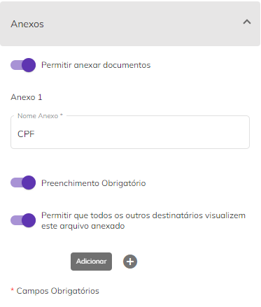<figcaption></figcaption></figure>

Clicando em “Descartar”, o documento será excluído. Clicando em “Concluir Mais Tarde” o documento será salvo na pasta de Rascunhos. Para editar o documento ou os destinatários, clique em “Voltar Etapa Anterior”. Finalizada a configuração dos campos de assinatura, clique em “Enviar” para enviar o documento para assinatura dos destinatários.

<figure>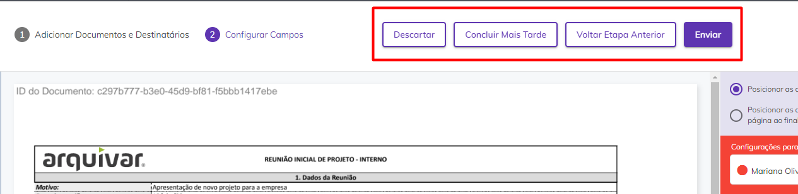<figcaption></figcaption></figure>
