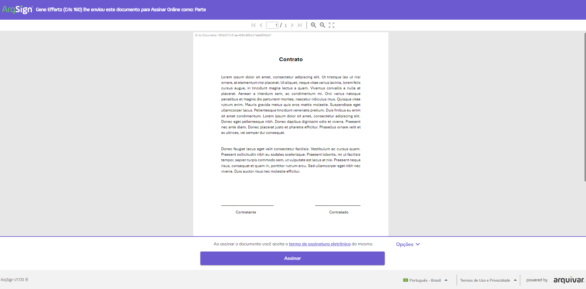

# ▫ Janeiro | 2024

Mudança do cabeçalho e rodapé da tela de assinatura

A visualização da tela de assinatura foi alterada. Agora, os nomes do responsável pelo envio e do documento são exibidos na parte superior da tela de assinatura. Também foi incluída na parte superior a navegação entre páginas e os botões de zoom e visualização do documento em tela cheia.

O botão de assinatura passou a ser exibido na parte inferior da tela, junto com as opções de ação (Registro de Assinaturas, Exibir Histórico, Recusar Assinatura, Concluir Mais Tarde e Baixar Arquivo).

Agora, o signatário não precisa mais marcar o termo de aceite de assinatura eletrônica. Ao assinar o documento o sistema registrará o aceite automaticamente.  &#x20;

Os detalhes dessas alterações estão na página Assinatura de Documentos.

