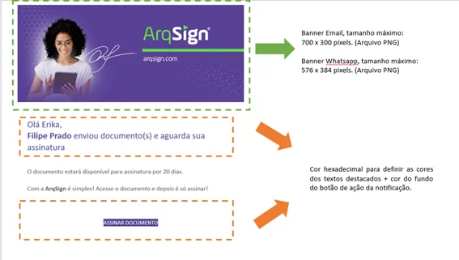

# 🟪 Como Usar

Descubra como é fácil e prático utilizar a ArqSign para assinar seus documentos. Com apenas alguns cliques você concluí com êxito uma tarefa que antes era demorada e muitas vezes burocrática.

Conheça a plataforma ArqSign

**Conhecendo a Plataforma**

Acesse a plataforma de Assinatura e configure a sua Assinatura Eletrônica.

Do lado esquerdo da tela temos todos os menus disponíveis, separados por grupos: Caixa Postal, Diretórios e Administração. É importante destacar que esses menus serão apresentados conforme nível de permissão de cada usuário. Clique na imagem para ampliar.

 (1).png>)

**CAIXA POSTAL:** Neste grupo estão concentrados os menus referentes ao processo de tramitação dos documentos. Clique na imagem para ampliar.

.png>)

**DIRETÓRIOS:** Neste grupo temos o menu Documentos. Ele é considerado um repositório de armazenamento dos documentos tramitados pela plataforma, ou seja, aqui são encontrados todos os documentos com processo de assinatura concluído. Clique na imagem para ampliar.

.png>)

**ADMINISTRAÇÃO:** Neste grupo temos as configurações de conta, usuários e grupo de usuários.

.png>)

Assinando um documento por meio do celular

1\. O processo de assinatura em lote também pode ser realizado diretamente pelo celular, e ocorre da mesma forma como na plataforma.

2\. A opção de “Assinatura em Lote” é apresentada, assim como a lista de documentos pendentes de assinatura para seleção. Feita a seleção dos documentos, clique no ícone “Assinatura em Lote”.

.png>)

3. Preencha os dados solicitados.

.png>)

4. Defina a representação visual (Estilo de Assinatura).

.png>)

5. Acompanhe o progresso das assinaturas.

.png>)

6. Será apresentado o informativo do processo concluído.

.png>)

7. Concluído o processo de assinatura por todos os responsáveis, o documento final pode ser consultado no ArqGED, pois ele será mantido no fluxo.

Como assinar documentos pela plataforma ArqSign?

[Clique aqui e confira como realizar a assinatura de documentos por meio da plataforma ArqSign.](../assinatura-de-documentos.md)

Como assinar documentos em lote?

[Clique aqui e confira como realizar a assinatura de documentos em lote por meio da plataforma ArqSign.](../menu-superior/assinatura-em-lote.md)

Como configurar a assinatura?

1. Acesse a plataforma de Assinatura e configure a sua Assinatura Eletrônica.
2. Depois de logado, clique sobre o seu nome no canto superior direito.
3. Clique em “Meu Perfil”.

.png>)

**Aba “Meus Dados”**

1\. Certifique-se que seus dados estejam todos atualizados. Caso deseje alterar algo, clique em “Editar” para habilitar os campos de edição.

.png>)

**Aba “Meus Contatos”**

Nesta aba é possível manter uma lista com os contatos mais usados na plataforma.

1\. Nesta aba é possível “Salvar os destinatários de um documento enviado para assinatura em minha lista de contatos”.

2\. Clicando no ícone “+” é possível adicionar contatos. Ao clicar nesta opção é habilitada uma tela destinada ao cadastro de um novo contato para incluir na lista. Informados os dados do contato, clique “Salvar” ou “Salvar e Fechar”.

.png>)

**Ícones – Aba “Meus Contatos”**

.png>)

**Aba “Estilo de Assinatura”**

1\. Nesta aba realize o cadastro das assinaturas que usará nos processos de assinatura de documentos. Clique em “Editar” para habilitar os campos.

2\. Passe pelas três opções existentes. Logo após concluir, clique em “Salvar”.

.png>)

**Aba “Certificado Digital”**

1\. Nesta aba é possível carregar certificados digitais na nuvem, armazenando na Plataforma ArqSign. Estes certificados armazenados serão listados no momento em que o usuário logado estiver assinando um documento com o tipo de assinatura Certificado Digital (ICP).

.png>)

**Aba “Solicitações”**

1\. Na aba Solicitações o usuário pode consultar as solicitações de transferência de proprietário do documento. Por exemplo, se na caixa de entrada o usuário alterar o proprietário do documento, a movimentação ficará registrada na aba “Solicitações”.

.png>)

Como habilitar / desabilitar a geração de QRCode no Registro de Assinaturas para acesso ao documento assinado?

Para padronizar a configuração de geração de QRCode no Registro de assinaturas para uma conta, você deverá ser um usuário com perfil Administrador Global ou Administrador da Conta e seguir os seguintes passos:

* Acesse: Administração > Conta > Configurações > Documentos;
* Clique em “Editar”;
* Em “Configurações sobre a Disponibilização do Documento Assinado aos destinatários” habilite ou desabilite a geração de QRCode no Registro de assinaturas conforme sua preferência;
* Clique em Salvar.

Essa alteração repercute para conta.

Caso necessário, um usuário com qualquer perfil pode alterar a configuração padrão desta funcionalidade apenas para um determinado fluxo. Para isso, basta seguir os seguintes passos:

* Clicar em “Novo Documento”;
* Fazer o upload de um novo documento;
* Clicar em “Configurações Avançadas”;
* Habilitar ou desabilitar a geração de QRCode de acesso do documento no Registro de Assinaturas;
* Clicar em “Aplicar”.

Como compartilhar um contato salvo na plataforma ArqSign com outros usuários da conta?

No Menu “Meu perfil” opção “Meus contatos”, selecione o contato.

O sistema exibe os dados do registro no modo de visualização e os respectivos botões de ação conforme a permissão do usuário em questão.

As opções de ação exibidas poderão ser:

– Para contatos do usuário logado na conta logada: Novo, Editar e Cancelar.

– Para contatos compartilhados por outros usuários ativos na conta logada: Novo e Cancelar.

Para compartilhar um contato, escolha a opção “Editar”, marque a opção de compartilhamento e clique em Salvar.

Como excluir um contato salvo na plataforma Arqsign?

No Menu “Meu perfil” opção “Meus contatos”, selecione o contato.

O sistema exibe os dados do registro no modo de visualização e os respectivos botões de ação conforme a permissão do usuário em questão.

As opções de ação exibidas poderão ser:

– Para contatos do usuário logado na conta logada: Novo, Editar e Cancelar.

– Para contatos compartilhados por outros usuários ativos na conta logada: Novo e Cancelar.

Para excluir um contato, escolha a opção “Excluir” e confirme a exclusão.

Como editar um contato salvo na plataforma ArqSign?

No Menu “Meu perfil” opção “Meus contatos”, selecione o contato.

O sistema exibe os dados do registro no modo de visualização e os respectivos botões de ação conforme a permissão do usuário em questão.

As opções de ação exibidas poderão ser:

– Para contatos do usuário logado na conta logada: Novo, Editar e Cancelar.

– Para contatos compartilhados por outros usuários ativos na conta logada: Novo e Cancelar.

Para editar um contato, escolha a opção “Editar”, faça a edição e clique em Salvar.

Como enviar um documento para assinatura para um contato salvo na plataforma ArqSign?

Para enviar um documento para assinatura para um contato salvo na Plataforma ArqSign no seu usuário ou compartilhado por outro usuário, siga os seguintes passos:

1. Clique em “Novo Documento”, insira o documento e execute as configurações necessárias relativas ao documento;
2. Na parte de configuração dos Destinatários, clique no botão
3. A Plataforma exibirá um Grid de consulta com todos os contatos do usuário logado que estão relacionados com a conta logada, ordenados alfabeticamente pela coluna nome e na sequência todos os contatos dos outros usuários ativos da conta logada, que tenham sido marcados para serem compartilhados com todos os usuários da conta, ordenados alfabeticamente pela coluna nome.
4. Escolha o(s) destinatário(s) e clique em “Adicionar Destinatários”.
5. Configure o Tipo de Assinatura Eletrônica para cada destinatário;
6. Configure token de segurança ou mensagem privada para cada destinatário se for o caso e siga os próximos passos para envio do documento para assinatura.

Como salvar contatos na plataforma ArqSign?

Para salvar contatos na Plataforma ArqSign siga os seguintes passos:

1. Acesse o menu “Meu Perfil”
2. Acesse a opção “Meus contatos”
3. Para inserir um contato, clique no botão +, insira os dados, escolha se quer compartilhar o contato com todos os usuários da conta e clique em Salvar.
4. Para que que todos os contatos para os quais você enviar um documento para assinatura a partir de agora sejam automaticamente salvos, habilite o botão “Salvar os destinatários de um documento enviado para assinatura em minha lista de contatos”.

O Nome e o E-mail/WhatsApp do(s) destinatário(s) será(ão) salvo(s) como contato(s) do usuário na conta. Os contatos terão relação com a conta em que o usuário está logado. Ou seja, quando este usuário logar em outra conta, os contatos serão diferentes.

Regras:

Não é permitido cadastrar contato com o mesmo E-mail de um contato já cadastrado que:

– Seja contado do usuário logado na conta, em questão.

– Esteja relacionado a outros usuários ativos da conta logada e que estejam sendo compartilhado na conta.

Somente é permitido cadastrar contato do tipo e-mail com um e-mail válido.

Não é permitido cadastrar contato com mesmo Telefone de um contato já cadastrado que:

– Seja contado do usuário logado na conta, em questão.

– Esteja relacionado a outros usuários ativos da conta logada e que estejam sendo compartilhado na conta.

Somente é permitido cadastrar contato do WhatsApp com um número de telefone válido.

O campo “Compartilhar com todos os usuários da conta.” é de preenchimento opcional para o usuário informar se o contato que está sendo criado será compartilhado, ou não, com outros contatos da conta.&#x20;

Para entender melhor, clique no link e assista ao vídeo explicativo: [https://youtu.be/b73Cu1HCaWA](https://youtu.be/b73Cu1HCaWA)

Como verificar a validade de um documento impresso assinado na plataforma ArqSign, por meio do QRCode?

Se você tem um documento impresso que foi assinado através da plataforma ArqSign e precisa verificar sua validade, existem alguns itens de segurança que você pode verificar conforme abaixo:

1. Localize nas páginas do documento assinado através da Plataforma ArqSign uma marca d’água com o “**ID do documento”** no canto superior esquerdo;
2. Confirme que o “**ID do documento**” é o mesmo em todas as páginas e no Registro de Assinaturas.
3. Toda vez que um documento é assinado através da Plataforma ArqSign, um arquivo com o nome de “Registro de Assinaturas” é gerado. O “Registro de Assinaturas” contém:

a) A identificação do documento a que pertence, ou seja, o “**ID do documento**”;

b) O **Hash** do documento (comprovação de integridade do documento);

c) Informações sobre o **Remetente, data de criação e envio**;

d) **Status** do documento, **tamanho**, **quantidade de páginas e assinaturas**;

e) **QRCode** que dá **acesso ao documento na Plataforma ArqSign**\*;

f) **Link** que dá **acesso ao documento na Plataforma ArqSign**\*;

g) **Detalhamento de todas as assinaturas contendo:**

I. Nome

II. E-mail

III. Documento

IV. Nível de segurança

V. Certificado ICP-Brasil utilizado

VI. Data e hora

VII. IP do dispositivo

VIII. Geolocalização

h) Trilha de auditoria percorrida por cada participante do Fluxo de assinaturas detalhada através dos eventos:

I. Lido – por qual signatário, data e hora, IP e Geolocalização

II. Assinatura Online – por qual signatário, data e hora, IP e Geolocalização.

4\. Caso você queira verificar a validade jurídica do documento no Portal ITI ou Adobe, acesse o documento através do QRCode.

\*Ao acessar o documento na Plataforma ArqSign via **QRCode ou link,** você poderá:

* Baixar o documento e o “Registro de Assinaturas”;
* Exibir o histórico (trilha de auditoria);
* Exibir o Termo de aceite para assinatura eletrônica;
* Verificar os detalhes das assinaturas.

Como pesquisar um documento na plataforma ArqSign?

Localizar um documento na na Plataforma ArqSign é super prático, basta seguir as instruções abaixo:

Primeiro, encontre a Caixa onde o documento está localizado. Todas as caixas (Caixa de entrada, Enviados, Rascunhos, Excluídos, Renovações) têm a funcionalidade de pesquisa, que aparece como “Filtrar”.&#x20;

Clique no campo “Filtrar”.&#x20;

As opções de pesquisa serão exibidas.&#x20;

Insira as informações de pesquisa nos campos desejados, como o nome do signatário, status, pasta do documento ou data de conclusão.&#x20;

Clique em “Filtrar”.&#x20;

Todos os documentos correspondentes às informações inseridas nos filtros serão exibidos.&#x20;

Para cancelar o filtro, basta clicar no “X” que aparece no canto direito do campo “Filtrar”.&#x20;

Vi como é fácil? Agora você pode localizar seus documentos na Plataforma ArqSign de forma rápida e eficiente!&#x20;

Personalização da plataforma ArqSign com as cores e logomarca do cliente

Na plataforma ArqSign, as notificações (e-mails e mensagens de WhatsApp) para os remetentes e destinatários podem ter os seguintes layouts:&#x20;

1. Layout Padrão da Plataforma ArqSign ou&#x20;
2. Layout com suas cores e logomarca.&#x20;

Os itens disponíveis para personalização são:&#x20;

* Cabeçalho&#x20;
* Cor do texto superior&#x20;
* Cor do botão do e-mail ou mensagem de WhatsApp&#x20;

Para personalizar as notificações da Plataforma ArqSign, basta que o Administrador da conta acesse: Administração > Conta > Configurações > Outros e seguir os seguintes passos:&#x20;

1. No canto inferior direito clique em editar;&#x20;
2. Em “Notificações Personalizas”, altere para Ativado;&#x20;
3. Em “Notificações por E-mail”, execute as seguintes etapas:&#x20;

* insira uma imagem para o cabeçalho das mensagens com as dimensões descritas no campo;&#x20;
* escolha a cor de destaque para o texto do e-mail.&#x20;

&#x20;     4\. Em “Notificações por WhatsApp”, execute a seguinte etapa:&#x20;

* Insira uma imagem para cabeçalho das mensagens com as dimensões descritas no campo.&#x20;

&#x20;     5\. Se quiser visualizar as notificações com as mudanças que você fez clique em “Visualizar Notificação”;&#x20;

&#x20;     6\. Quando todos os ajustes estiverem ok, clique em “Salvar”.&#x20;

Notificação padrão:

.png>)

Exemplo de notificação personalizada simulação:

.png>)

Como configurar uma mensagem personalizada?

1. Clique em ‘Novo Documento’
2. Selecione o documento que deseja encaminhar e informe os dados do signatário como nome, e-mail etc.
3. Abaixo dessas informações haverá um símbolo de ‘mensagem’ , onde ao clicar abrirá uma aba de mensagem personalizada.
4. Na aba de mensagem personalizada é possível informar o assunto e a mensagem que deseja enviar somente para o signatário selecionado. Os demais signatários receberão a mensagem padrão.

Como configurar o token de segurança?

1. Clique em ‘Novo Documento’
2. Selecione o documento que deseja encaminhar e informe os dados do signatário como nome, e-mail etc.
3. Abaixo dessas informações haverá um símbolo de um ‘cadeado’, onde ao clicar abrirá uma aba de segurança.
4. Na aba de segurança é possível gerar o código ‘Automaticamente ou Manual’ e informar o e-mail, SMS, Whatsapp ou nenhum meio em que deseja encaminhar o token.
5. Após essas configurações o token de segurança será enviado através do meio selecionado quando o signatário clicar para acessar o documento ou se você não selecionou nenhum meio você poderá informar para o signatário.

Como solicitar anexos e selfie?

1. Clique em ‘Novo Documento’
2. Selecione o documento que deseja encaminhar e configure os destinatários e avance
3. Configure o campo de assinatura do destinatário, caso deseje solicite as informações complementares como Nome e Documento
4. No canto direito role a tela e o menu de Anexos irá aparecer, selecione o checkbox para permitir que o signatário anexe um documento.
5. Informe o documento que deseja que o signatário encaminhe e se deseja que o anexo seja obrigatório para a conclusão do processo de assinatura daquele documento.
6. Você também pode configurar se permite que todos os signatários acessem o anexo ou não.

Quando o destinatário receber o documento para assinar ele deverá proceder da seguinte forma:

1. Assinar o documento e preencher dados solicitados;
2. Clicar na solicitação de Selfie;
3. Acessar a câmera do celular ou computador;
4. Fazer a foto conforme solicitado;
5. Escolher a foto como anexo;
6. Clicar em “Assinar e concluir”.

